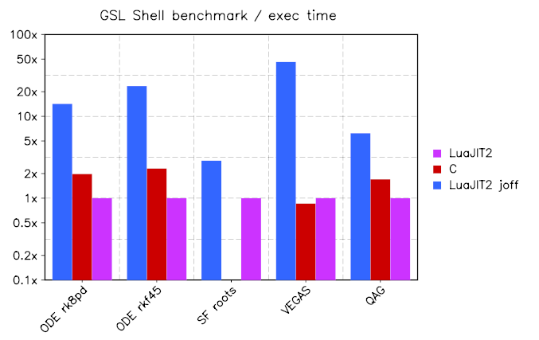

.. _benchmarks:

Benchmarks
==========

The performance of the algorithms implemented in GSL Shell have been tested against an equivalent C implementation.

The purpose of the benchmarks is twofold. One of the objectives is to test the correctness of the results against the native GSL implementation while the other is to compare C and Lua implementation in term of performance.

The performance is measured simply in term of time of execution, no attempt has been done to add other factors like memory utilization or others.

Besides the benchmark of optimized C code the LuaJIT2 implementation was tested with and without the JIT support enabled.
When the JIT support is disabled (option ``-joff``) the algorithm is executed in purely interpreted mode.
This latter result is reported to give an idea of the improvement given by the JIT compiler.

Results
-------

We present here the results of the benchmark in term of execution time.
The time is normalized taking the ratio with the 'LuaJIT2' results.
The ratio obtained is therefore plotted in logarithmic scale.

A few remarks about these results.

Only a very few ODE algorithms are currently implemented in GSL Shell and these use an interface different of those used in the GSL library.
In GSL Shell the variables of the ode system are not packed into an array but are passed like function arguments.
One implication is that only ODE system with a small number of variables can be integrated.
This difference can affect the execution speed and should be kept in mind.

Otherwise there is nothing that prevents the implementation in GSL Shell of an ODE integrator in array form.
This is actually planned to be done in the near future.

For all the other algorithms the GSL implementation closely mirror the GSL interface and the comparison is absolutely fair.

Technical details
-----------------

The C and Lua version of the benchmark was written to solve exactly the same problem with the same input values and the same algorithm parameters.

The C version of the benchmark was compiled using the following compiler flags: ``-O2 -fomit-frame-pointer``.
The GSL library itself was compiled with the same options and the executable was created by linking to the GSL shared library.

While some tweak of the compiler options are possible to improve performance of GSL C code no attempt was done in this direction.
The idea was that we want to compare the Lua implementation with a C executable compiled with standard optimizing options and in accord to common practices.

Benchmark availability
----------------------

The source code of all the benchmark is available with the GSL Shell source code inside the 'benchmarks' folder.

We encourage all the interested users to reproduce the benchmarks results by themselves.
