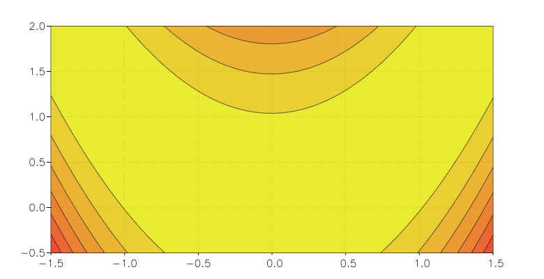

.. highlight:: lua

.. include:: <isogrk1.txt>

Contour Plots
=============

Overview
--------

GSL shell offer a contour plot function to draw contour curve of bidimensional functions. The current algorthm works correctly only for continous functions and it may gives bad results if the function have discontinuities.

Here an example of its utilisation to plot the function :math:`f(x,y) = x^2 - y^2`::

   require 'contour'

   contour(|x,y| x^2 - y^2, -8, -8, 8, 8)

.. figure:: contour-plot-hyper.png

.. function:: contour(f, xmin, ymin, xmax, ymax[, options]])

   Plot a contour plot of the function ``f``. ``contours`` can be the number of levels or a list containing all the values that should be used to draw the contours.

   The ``options`` argument is an optional table that can contain the following field:
 
   * ``gridx``, number of subdivision along x
   * ``gridy``, number of subdivision along y
   * ``levels``, number of contour levels or a list of the level values in monotonic order.
   * ``colormap`` a function that return a color for the contour region. The argumet of the function will be a number between 0 and 1.

.. function:: polar_contour(f, R[, options]])

   Plot a contour plot of the function ``f(x, y)`` over the circular domain or radius ``R`` and centered at the origin. The ``options`` table accept the same field of the function :func:`contour`.

   Example::

     p = polar_contour(|x,y| cos(x)+cos(y)+0.1*x+0.3*y, 8)
     p.title = 'cos(x) + cos(y) + 0.1*x + 0.3*y'
   
   .. figure:: polar-contour-example-cos-cos.png

High Precision Contour
----------------------

An *experimental* high precision contour plot is available with the module "hpcontour". It allows to plot accurate curves regardless of the grid chosen. This module use an algorithm that traces the contour curves by using the technique of the "implicit curve". This technique seems to be known as the predictor-corrector algorithm. The disadvantages of this algorithm are that it is computation intensive and it does require the derivatives of the function.

The algorithm is still experimental and works if the function respects some requirements:

  * the function should be differentiable in all the domain and the derivatives should be continuous
  * there should not be any contour curve that contains a point where the derivatives are identically zero

Also the algorithm is not completely robust and it may give unaccurate results in some rare cases.

Having saying that the algorithm works flawlessly for many types of functions and it can be used to draw accurate curves.

Example
```````

In this example we show how to trace accurate contour curves for the Rosenbrock functions. Here the rosenbrock function with its derivatives::

   function rosenbrock(x, g)
      local x, y = x[1], x[2]
      local v = 100*(y-x^2)^2 + (1-x)^2
      if g then
         g:set(1,1, -4*100*(y-x^2)*x - 2*(1-x))
         g:set(2,1,  2*100*(y-x^2))
      end
      return v
   end

Then, in order to draw the contour curves close to the minimum we
choose a non-uniform set of contour levels with more levels near the
minimum value. Here the contour levels that we choose::

   N, pt = 7, new(2,1)
   pt:set(1,1, 1.0)
   function frbeval(k) 
      pt:set(2,1, 1 - (k/N)^2)
      return frosenbrock(pt)
   end
   levels = ilist(frbeval, N)

Then we can draw the contour curve. Please note that we need to load the module "hpcontour" in order to have access to the function "hpcontour". Then we call the function as follows::

   hpcontour(frosenbrock, {-1.5, -0.5}, {1.5, 2}, 40, 40, levels)

and we obtain the following image:

.. figure:: hpcontour-rosenbrock-example.png

Otherwise, with unformly spaced contour levels the resulting image would have been the following:


