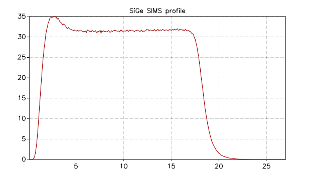
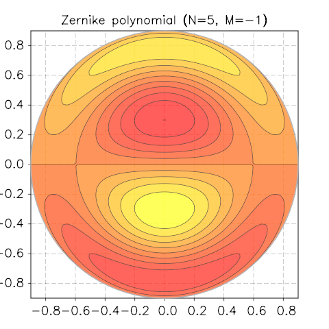

.. highlight:: lua

.. include:: <isogrk1.txt>

.. _gsl-shell-examples:

GSL Shell Examples
==================

In this chapter we gives some examples about the usage of GSL Shell.

Home-made Bessel Functions
--------------------------

The Bessel's function J\ :sub:`n` for integer values of n can de defined with the following integral:

.. math::
   J_n(x) = {1 \over \pi} \int_0^\pi \cos(n \tau - x \sin \tau) \textrm{d}\tau

We can use this definition to define our home-made Bessel function. To perform the integral we need to use the ``integ`` function and provide the function to integrate. This is easy like eating a piece of cake::

   function bessJ(x,n)
      local f = |t| cos(n*t - x*sin(t)) -- we define the function to integrate
      return 1/pi * integ {f= f, points={0, pi}}
   end

The definition of ``bessJ`` takes x and n as arguments and calculate the definite integral between 0 and |pgr|. Then we can plot the results for various values of n::

   p = plot('Bessel Functions Jn, n=0 ... 5')
   color = {'red', 'green', 'blue', 'cyan', 'magenta'}
   for n=0, 5 do
      p:addline(fxline(|x| bessJ(x,n), 0, 20), color[n+1])
   end
   p:show()

to obtain the following result:

.. figure:: example-bessJ-plot.png

Then we can also calculate a matrix with the tabulated values. For examples we can use the columns of the matrix to span different values of n. We write then::

   m = new(200, 6, |k,n| bessJ((k-1)/10, n-1))

And we obtain the following matrix::

  [           1           0           0           0           0           0 ]
  [    0.997502   0.0499375  0.00124896 2.08203e-05 2.60286e-07           0 ]
  [    0.990025   0.0995008  0.00498335  0.00016625 4.15834e-06 8.31945e-08 ]
  [    0.977626    0.148319   0.0111659 0.000559343  2.0999e-05 6.30443e-07 ]
  [    0.960398    0.196027   0.0197347  0.00132005 6.61351e-05 2.64894e-06 ]
  [     0.93847    0.242268    0.030604  0.00256373 0.000160736 8.05363e-06 ]
  [    0.912005    0.286701   0.0436651  0.00439966  0.00033147 1.99482e-05 ]
  [    0.881201    0.328996   0.0587869  0.00692965 0.000610097 4.28824e-05 ]
  [    0.846287    0.368842   0.0758178   0.0102468  0.00103298 8.30836e-05 ]
  [    0.807524     0.40595   0.0945863    0.014434  0.00164055 0.000148658 ]
  [    0.765198    0.440051    0.114903   0.0195634  0.00247664 0.000249758 ]
  [ ... ]

The Von-Koch curve
------------------

The `Von-Koch curve <http://en.wikipedia.org/wiki/Koch_snowflake>`_ is a simple and beautiful fractal curve described in 1904 by the swedish mathematician Helge von Koch.

Here an example to plot it with GSL Shell. First we need a function to produce the curve, we are not going to explain the details but the following code can do the job::

   function vonkoch(n)
      local sx = {2, 1, -1, -2, -1,  1}
      local sy = {0, 1,  1,  0, -1, -1}
      local sh = {1, -2, 1}
      local a, x, y = 0, 0, 0
      local w = ilist(|| 0, n+1)
   
      local s = 1 / (3^n)
      for k=1, 6 do
         sx[k] = s * 0.5 * sx[k]
         sy[k] = s * sqrt(3)/2 * sy[k]
      end
   
      local first = true
   
      return function()
   	     if first then first = false; return x, y end
   	     if w[n+1] == 0 then
   		x, y = x + sx[a+1], y + sy[a+1]
   		for k=1,n+1 do
   		   w[k] = (w[k] + 1) % 4
   		   if w[k] ~= 0 then
   		      a = (a + sh[w[k]]) % 6
   		      break
   		   end
   		end
   		return x, y
   	     end
   	  end
   end

Then we need to produce the plot. Since we want to make something cool we produce a closed Von Koch triangle by using always the same curve and adding it to the plot with some rotations and translations. We also produce a nice semi-transparent background to have something more beautiful. Here the code::

   p = plot()

   t = path()
   t:move_to(0,0)
   t:line_to(1,0)
   t:line_to(0.5,-sqrt(3)/2)
   t:close()

   v = ipath(vonkoch(4))
   c = rgba(0,0,0.7,0.2)
   p:add(v, c)
   p:add(v, c, {}, {{'translate', x=1, y=0}, {'rotate', angle=-2*pi/3}})
   p:add(v, c, {}, {{'translate', x=0.5, y=-sqrt(3)/2}, {'rotate', angle=-2*2*pi/3}})
   p:add(t, c)

   c = rgb(0,0,0.7)

   p:add(v, c, {{'stroke'}})
   p:add(v, c, {{'stroke'}}, {{'translate', x=1, y=0}, {'rotate', angle=-2*pi/3}})
   p:add(v, c, {{'stroke'}}, {{'translate', x=0.5, y=-sqrt(3)/2}, {'rotate', angle=-2*2*pi/3}})

   p:show()

And here the result:

.. figure:: examples-von-koch-complete.png

With a similar procedure, the code is in ``examples/fractals.lua`` we can produce  beautiful Levy C curve:

.. figure:: examples-levy-c-curve-1.png

Reading and plotting data from files
------------------------------------

In this example we show how to load some data stored in a file in CSV format and to make some plot. The CSV is a very simple format that can be used to exchange data with spreadsheets applications. It is just a plain text with several lines where each line consists of a comma-separated list of numbers or strings.

In order to load the data you need to charge the module :mod:`csv` and the to use the function :func:`~csv.read`. In this example we will use the data stored in the file ``examples/data/sige-sims-prof.csv`` this set of data contains just two columns, the first one is the x and the second column represent the y. Here the simple code to load the data::

   require 'csv'
   t = csv.read('examples/data/sige-sims-prof.csv')

we can then print the number of lines in the table:

   >>> #t
   316

If you want to plot the data in the table there isn't actually any function that will do that right way but you can do it by using a few functions::

  p = plot()
  p:addline(ipath(sequence(function(i) return t[i][1], t[i][2] end, #t)))
  p:show()

the idea is that, in order to plot the curve we need to *build* the curve before. What we want is actually a line that connects the points ``(x[i], y[i])`` where ``x[i]`` and ``y[i]`` are taken from the rows of the table ``t``. The last resort to obtain that would be to create a :class:`Path` object and to give all the points in a procedural way like this::

  -- we create a path and gives it the starting point
  ln = path(t[1][1], t[1][2])
 
  for i=2, #t do
    ln:line_to(t[i][1], t[i][2])
  end

but it can be more handy to use the :func:`ipath` function to build the curve. This latter function build a curve using an iterator that returns values in the form ``(x, y)``. Then to obtain the iterator we use the :func:`sequence` function that let us easily build an iterator over a sequence of integer numbers.

So to make more clear the code given above we can separate the curve and the iterator instatiations like in the following example::

  p = plot()

  -- we define our iterator
  it = sequence(function(i) return t[i][1], t[i][2] end, #t)

  -- we create the curve using the iterator just defined
  line = ipath(it)

  -- then we add it to the plot, we give a title and show the result
  p:addline(line)
  p.title = "SiGe SIMS profile"
  p:show()

and here the resulting image:

Zernike Polynomials
-------------------

*Taken from Wikipedia*

In mathematics, the Zernike polynomials are a sequence of polynomials that are orthogonal on the unit disk. Named after Frits Zernike, they play an important role in beam optics.

Definitions
~~~~~~~~~~~

There are even and odd Zernike polynomials. The even ones are defined as

.. math::
     Z_n^m(\rho, \phi) = R_n^m(\rho) \cos(m \phi)

and the odd ones as

.. math::
     Z_n^{-m}(\rho, \phi) = R_n^m(\rho) \sin(m \phi)

where m and n are nonnegative integers with n≥m, φ is the azimuthal angle, and ρ is the radial distance . The radial polynomials R\ :sub:`n`\ :sup:`m` are defined as

.. math::
     R_n^m(\rho) = \sum_{k=0}^{(n-m)/2} \frac{(-1)^k (n-k)!}{k! ((n+m)/2-k)! ((n-m)/2 - k)!} \rho^{n - 2 k}

for n − m even, and are identically 0 for n − m odd.
For m = 0, the even definition is used which reduces to R\ :sub:`n`\ :sup:`0`\ (ρ).

Implementation
~~~~~~~~~~~~~~

The above formula can be implemented quite straightforwardly in GSL shell with only a subtle point about the factorials in the denominator. The problem is that in same cases you can have the factorial of negative number and if you feed a negative number to the :func:`fact` function you will get an error.

Actually the meaning of the formula is that the factorial of a negative number if :math:`\infty` and so, since it does appear in the denominator, its contribution to the sum is null. So, in order to implement this behaviour we just define an euxialiary function that return the inverse of the factorial and zero when the argument is negative.

So here the code for the radial part::

  -- inverse factorial function definition
  invf = |n| n >= 0 and 1/fact(n) or 0

  -- radial part of Zernike's polynomial
  function zerR(n, m, p)
     local ip, im = (n+m)/2, (n-m)/2
     local z = 0
     for k=0, im do
        local f = fact(n-k) * (invf(k) * invf(ip-k) * invf(im-k))
        if f > 0 then z = z + (-1)^k * f * p^(n-2*k) end
     end
     return z
  end

and the we define the Zernike's function completed with the angular part::

  function zernicke(n, m, p, phi, even)
     local pf = even and cos(m*phi) or sin(-m*phi)
     return zerR(n, m, p) * pf
  end

Now we are just ready to draw our function, the only missing piece is the relation between ρ, φ and the cartesian coordinates but this is trivial:

.. math::
   \begin{array}{ll}
     \rho = & \sqrt{x^2 + y^2} \\
     \phi = & \tan^{-1}(y, x)
   \end{array}

let us therefore define our sample function in term of x and y and use it to call the function :func:`polar_contour`::

  require 'contour'
  N, M = 8, -2
  f = |x,y| zernicke(N, M, sqrt(x^2+y^2), atan2(y,x))
  p = polar_contour(f, 0.9, {gridx= 81, gridy= 81, levels= 10})
  p.title = string.format('Zernike polynomial (N=%i, M=%i)', N, M)

We show a few screenshots of the contour plot for various N and M.

.. figure:: zernicke-contour-3-1.png

.. figure:: zernicke-contour-5-5.png

.. figure:: zernicke-contour-8-2.png
