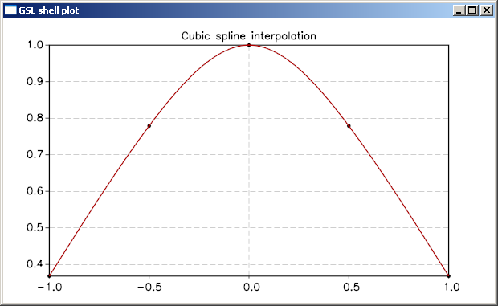

.. highlight:: lua

.. include:: <isogrk1.txt>
.. include:: <isotech.txt>

Interpolation
=============

This chapter describes functions for performing interpolation.  The
library provides a variety of interpolation methods, including Cubic
splines and Akima splines. Interpolations can be defined for both
normal and periodic boundary conditions.

Simple Usage
------------

You can perform interpolation very easily in GSL shell, what you need is two column matrix, let's say "x" and "y", that contains respectively, the points where the function is sampled and the corrisponding values of the function.

Once you have the data in this format you can use the :func:`interp` function by giving the x and y vectors and a string defining the type of interpolation that you want. The function will return an object of type :class:`Interpolation`.

Here a simple example::

  
  x = vector {-1, -0.5, 0, 0.5, 1} -- create a vector with the x points
  y = new(5, 1, |k| exp(-x[k]^2)) -- define y values based on function exp(-x^2)

  -- create an interpolation of data with cubic spline method
  ip = interp(x, y, 'cspline')
 
Once you have the interpolation object you may wonder how to use it. This is actually very easy, just use the "eval" method to evaluate the interpolation to a given value. So, for example, if we want to evaluate the interpolation defined before at the point -0.3 we can write ``ip:eval(-0.3)``.

To complete our example we show how to create a plot with the sampling points and the interpolating curve::

  p = plot('Cubic spline interpolation')
  -- we add the points with black dots
  p:add(xyline(x, y), 'black', {{'marker', size= 5}}) 
  -- we add the interpolating function
  p:addline(fxline(|x| ip:eval(x), -1, 1))
  p:show()

and here the resulting plot:

Interpolating Functions
-----------------------

.. class:: Interpolation

  .. function:: interp(x, y, interp_type)

     Return an :class:`Interpolation` object for the data ``x`` and
     ``y``. The last argument, ``interp_type`` should be a string that
     specify the kind of interpolation. The most common type of
     interpolation are ``linear`` and ``cspline``. Please look at the
     section on :ref:`interpolation types <interp-types>` if you want
     more details.

  .. method:: eval(x)

     Evaluate the interpolation at the point ``x``.

  .. method:: deriv(x)

     Evaluate the interpolation of the derivative at the point ``x``.

  .. method:: deriv2(x)

     Evaluate the interpolation of the 2nd derivative at the point ``x``.

  .. method:: integ(a, b)

     Evaluate the definite integral of the interpolated function in the interval ``(a, b)``.

.. _interp-type:

Interpolation types
-------------------

The interpolation library provides six interpolation types:

``linear``
     Linear interpolation.

``polynomial``
     Polynomial interpolation.  This method should only be used for
     interpolating small numbers of points because polynomial
     interpolation introduces large oscillations, even for well-behaved
     datasets.  The number of terms in the interpolating polynomial is
     equal to the number of points.

``cpline``
     Cubic spline with natural boundary conditions.  The resulting
     curve is piecewise cubic on each interval, with matching first and
     second derivatives at the supplied data-points.  The second
     derivative is chosen to be zero at the first point and last point.

``cpline_periodic``
     Cubic spline with periodic boundary conditions.  The resulting
     curve is piecewise cubic on each interval, with matching first and
     second derivatives at the supplied data-points.  The derivatives
     at the first and last points are also matched.  Note that the last
     point in the data must have the same y-value as the first point,
     otherwise the resulting periodic interpolation will have a
     discontinuity at the boundary.

``akima``
     Non-rounded Akima spline with natural boundary conditions.  This
     method uses the non-rounded corner algorithm of Wodicka.

``akima_periodic``
     Non-rounded Akima spline with periodic boundary conditions.  This
     method uses the non-rounded corner algorithm of Wodicka.
