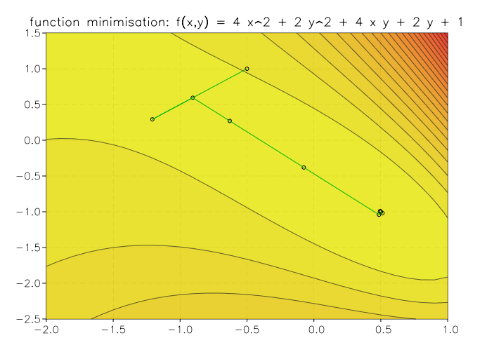

.. highlight:: lua

.. include:: <isogrk1.txt>

Function minimization
=====================

This chapter describes the functions to find the minimum of arbitrary function of multiple variables. 

Introduction
------------

The problem of multidimensional minimization requires finding a point x
such that the scalar function,

.. math::
     f(x_1, ..., x_n)

takes a value which is lower than at any neighboring point. For smooth
functions the gradient :math:`g = \nabla f` vanishes at the minimum. In general
there are no bracketing methods available for the minimization of
n-dimensional functions.  The algorithms proceed from an initial guess
using a search algorithm which attempts to move in a downhill direction.

Algorithms making use of the gradient of the function perform a
one-dimensional line minimization along this direction until the lowest
point is found to a suitable tolerance.  The search direction is then
updated with local information from the function and its derivatives,
and the whole process repeated until the true n-dimensional minimum is
found.

Algorithms which do not require the gradient of the function use
different strategies.  For example, the Nelder-Mead Simplex algorithm
maintains n+1 trial parameter vectors as the vertices of a
n-dimensional simplex.  On each iteration it tries to improve the worst
vertex of the simplex by geometrical transformations.  The iterations
are continued until the overall size of the simplex has decreased
sufficiently.

Both types of algorithms are available with the same interface. You just need to create a 'minimizer' object by providing either a simple function or a function with the derivatives. You can also, 'optionally' choose a minimization method or otherwise the default method will be used. There are three
main phases of the iteration.  The steps are,

   * initialize minimizer state, S, for algorithm T
   * update S using the iteration T
   * test S for convergence, and repeat iteration if necessary

Each iteration step consists either of an improvement to the
line-minimization in the current direction or an update to the search
direction itself. At any time you can query the minimizer object to ask about the current best estimates of the point or to have other informations about its current state.

Creating a minimizer
--------------------

The first step when you want to minimize a function is to create a minimizer object. This can be done very easily with the function :func:`minimizer` and by giving a table with the following fields:

  ``n``
    The dimension of the space where the search should be made.

  ``fdf`` or ``f``
    You specify the function that should be minimized. If ``f`` is provided al algorithm without derivatives will be used. The function ``f`` will be called with a single vector ``x`` as an argument. The function should return a simple real number. If the field ``fdf`` is specified then an algorithm that use derivatives will be selected. The function ``fdf`` will be called with two arguments::

      fdf(x, g)
 
    Where x is a vector as before and g is another vector to store the derivatives of the function itself. The function ``fdf`` should assign to each component i of the vector g the values of the derivate :math:`{\partial f/\partial x_i}`. The vector g can be also ``nil`` and in this case the function should not calculate the derivatives. In any case the function should return a single real value which is the value of the function evaluated at the point x.

Example
-------

Let us suppose that we want to minimize the following function:

.. math::
   f(x, y) = e^x \left( 4 x^2 + 2 y^2 + 4 x y + 2 y + 1 \right)

If we want to use a minimization algorithm with derivatives whe should provide the derivatives of the function. These are easily calculated:

.. math::
     {\partial f \over \partial x} = e^x \left( 4 x^2 + 2 y^2 + 4 x y + 8 x + 6 y + 1 \right)

.. math::
     {\partial f \over \partial y} = e^x \left( 4 y + 4 x + 2 \right)

The we can implement in gsl shell the function as follows::

 fex = function(x, g)
	  local x1, x2 = x[1], x[2]
	  local z = 4*x1^2 + 2*x2^2 + 4*x1*x2 + 2*x2 + 1
	  local e = exp(x1)
	  if g then 
	     g:set(1,1, e * (z + 8*x1 + 4*x2))
	     g:set(2,1, e * (4*x2 + 4*x1 + 2))
	  end
	  return e * z
       end

Once we have defined the function we can create the minimizer and set the starting point::

   x0 = vector {-0.5, 1.0} -- the starting point
   m = minimizer {fdf= fex, n= 2}
   m:set(x0, vector {1, 1})

Then you can use the method :func:`step` on the object ``m`` to make a single "step" with the minimization algorithm and we check the returned value (a string) to know if the algorithm succeded or if more iterations are needed::

   while m:step() == 'continue' do
     print(tr(m.x))
   end
   print('Found minimum at: ', tr(m.x))
   print('with function value: ', m.value)

Here a plot of the path followed by the minimizer to find the solution inside a contour plot of the functions.

Minimizer class definition
--------------------------

Actually there are two minimizer type, those that use the function with derivative and those that does not. For the GSL shell users this difference is not very important because the appropriate type of object is created automatically by thefunction :func:`minimizer` depending on its arguments. The two class also have the same methods, so once the minimizer is created, you can use it in the same way regardless of its nature.

.. class:: fdfmultimin
   
   Multiple parameters minimizer class that make use of the
   derivatives to find the minimum.

   .. method:: set(x0, step)
      
      Set the minimizer current point to ``x0`` and the step size of the
      search to ``step``. This latter parameter can be also a vector
      but in this case the geometric mean will be used as a step size.

   .. method:: step()
      
      Advance the minimizer of a single step. It does return
      ``continue`` if it did not reach the optimal point or
      ``success`` if it does succeded to find the minimum.

   .. method:: run()
      
      Advance the minimizer until a minimum is found or raise an error
      if it cannot locate any minimum.

   .. attribute:: x

      Return the current estimate of the search point.

   .. attribute:: value

      Return the value of the function at the current position.

   .. attribute:: gradient
 
      Return the gradient of the function at the current position.

.. class:: fmultimin
   
   Minimizer class that does not use the derivatives. Its interface is
   the same of the :class:`fdfmultimin`.

   .. method:: set(x0, step)
      
      Set the minimizer current point to ``x0`` and the step size of
      the search to vector ``step``. This latter parameter should be a
      vector of the same size of ``x0`` and each of its components
      rapresents the step size in the corresponding direction. If a
      number is provided the step size are taken to its value for all
      the directions.

   .. method:: step()
      
      Advance the minimizer of a single step. It does return
      ``continue`` if it did not reach the optimal point or
      ``success`` if it does succeded to find the minimum.

   .. method:: run()
      
      Advance the minimizer until a minimum is found or raise an error
      if it cannot locate any minimum.

   .. attribute:: x

      Return the current estimate of the search point.

   .. attribute:: value

      Return the value of the function at the current position.
