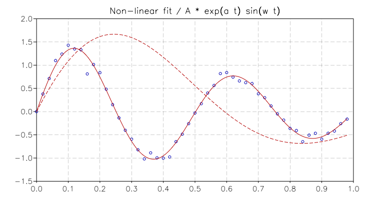

.. highlight:: lua

.. include:: <isogrk1.txt>

Nonlinear Least Squares fit
===========================

Overview
--------

GSL Shell provides support for nonlinear least squares fitting for user-defined data and functions. The data to fit can be either *real* or *complex* while the fitting parameters should be *real* numbers.

The problem of multidimensional nonlinear least-squares fitting requires
the minimization of the squared residuals of n functions, f\ :sub:`i`, in p
parameters, x\ :sub:`i`,

.. math::
     \Phi(x) = \frac{1}{2} || F(x) ||^2
             = \frac{1}{2} \sum_{i=1}^{n} f_i(x_1, ..., x_p)^2

All algorithms proceed from an initial guess using the linearization,

.. math::
     \psi(p) = || F(x+p) || \simeq || F(x) + J p ||

where x is the initial point, p is the proposed step and J is the
Jacobian matrix J\ :sub:`ij` = df\ :sub:`i` / dx\ :sub:`j`. 
Additional strategies are used
to enlarge the region of convergence.  These include requiring a
decrease in the norm ||F|| on each step or using a trust region to
avoid steps which fall outside the linear regime.

To perform a weighted least-squares fit of a nonlinear model Y(x,t)
to data (t\ :sub:`i`, y\ :sub:`i`) with independent gaussian errors
|sgr|\ :sub:`i`, use
function components of the following form

.. math::
     f_i = (Y(x, t_i) - y_i) / \sigma_i

Note that the model parameters are denoted by x in this chapter since
the non-linear least-squares algorithms are described geometrically
(i.e. finding the minimum of a surface).  The independent variable of
any data to be fitted is denoted by t.

With the definition above the Jacobian is
:math:`J_{ij} =(1 / \sigma_i)  d Y_i / d x_j`, where :math:`Y_i = Y(x,t_i)`.

Performing a non-linear fit
---------------------------

To perform a non-linear fit with GSL Shell there are two ways.

The simpler one use the function :func:`nlinfit` and can be used if the data depend on a single indipendent variable "x". In this case you will supply two vectors, "x" and "y", with the observations, a "model" function and the seeds for the fit. The seeds are the starting point for the search of the fit parameters.

The second method gives you more control and more flexibility over the non-linear fit. In this case you use directly the :class:`nlfsolver` and you can advance in the fit step-by-step by using the method :func:`iterate`.

In the following sections we give the details to use each method.

Simple non-linear fit
---------------------

.. function:: nlinfit(f, x, y, p0)

   Perform a non-linear fit of the function ``f`` with the data ``y`` over the indipendent variable ``x`` with initial seed ``p0``. The function  ``f`` will be called in the form ``f(p, x, J)`` where ``p`` is a column vector with the fit parameters, ``x`` is the real value where the function should be evaluated and ``J`` is a *row* vector. If ``J`` is not ``nil`` its n-th terms should be set to the value of the derivative of the function ``f`` with respect to the n-th fit parameters.

Here an example::

   px = vector {1.55, -1.1, 12.5}
   p0 = vector {2.5, -1.5, 5.3}
   n = 50
   xs = |i| (i-1)/n
   r = rng()

   f = function(p, x, J)
          local e, s = exp(p[2] * x), sin(p[3] * x)
          if J then
             J:set(1,1, e * s)
             J:set(1,2, x * p[1] * e * s)
	     J:set(1,3, x * p[1] * e * cos(p[3] * x))
          end
          return p[1] * e * s
       end

   y = new(n, 1, |i,j| f(px, xs(i)) * (1 + rnd.gaussian(r, 0.1)))
   x = new(n, 1, |i,j| xs(i))

   fit, pr = nlinfit(f, x, y, p0)

   print('Fit result:', tr(pr))

   pl = plot('Non-linear fit / A * exp(a t) sin(w t)') 
   pl:addline(xyline(x, y), 'blue', {{'marker', size= 5}})

   pl:addline(fxline(|x| f(p0, x), 0, xs(n)), 'red', {{'dash', a=7, b=3}})
   pl:addline(fxline(fit, 0, xs(n)), 'red')
   pl:show()

Creating a nonlinear fit solver
-------------------------------

The most basic method to perform a non linear fitting with GSL Shell does use the :class:`nlfsolver` object. The logical steps to use a nonlinear fitting solver are:

* create a new solver by specifying the number of data points *n*, the fitting function and the seeds to use as initial values.
* iterate the solver by using the :func:`iterate` until the algorithm
  converge to an acceptable solution.

We give an below the same example of the above section but by using directly the :class:`nlfsolver` object. We first define some useful elements::

   n = 50
   px = vector {1.55, -1.1, 12.5}
   p0 = vector {2.5,  -1.5, 5.3}
   xs = |i| (i-1)/n

Then we define the model function and the "fit function". You can note that the "fit function" uses the model function to set the vector ``f`` and the vector ``J`` for each observation. Note also that for the "fit function" ``J`` is a n x p matrix while for the model ``J`` is a row matrix::

   function fmodel(p, t, J)
      local e, s = exp(p[2] * t), sin(p[3] * t)
      if J then
         J:set(1,1, e * s)
	 J:set(1,2, t * p[1] * e * s)
	 J:set(1,3, t * p[1] * e * cos(p[3] * t))
      end
     return p[1] * e * s
   end

   function expf(x, f, J)
      for k=1, n do
	 local ym = fmodel(x, xs(k), J and J:row(k))
	 if f then f:set(k, 1, ym - y[k]) end
      end
   end

Then we create the data that we want to fit. We can use the model function itself by just adding some gaussian noise::

   r = rng()
   y = new(n, 1, |i,j| fmodel(px, xs(i)) * (1 + rnd.gaussian(r, 0.1)))
   x = new(n, 1, |i,j| xs(i))

The we create a plot and iterate the non-linear solver as long as it is required to converge::

   pl = plot('Non-linear fit / A * exp(a t) sin(w t)') 
   pl:addline(xyline(x, y), 'blue', {{'marker', size= 5}})

   s = nlfsolver {fdf= expf, n= n, p0= p0}

   pl:addline(fxline(|x| fmodel(s.p, x), 0, xs(n)), 'red', {{'dash', a=7, b=3}})

   repeat
      print('Chi square:', prod(s.f, s.f)[1], tr(s.p))
      local status = s:iterate()
   until status ~= 'continue'
   print('Chi square:', prod(s.f, s.f)[1], tr(s.p))

   pl:addline(fxline(|x| fmodel(s.p, x), 0, xs(n)), 'red')
   pl:show()

The output you obtain is:

| Chi square:, 61.909477682545, [  2.5 -1.5  5.3 ]
| Chi square:, 24.637775808867, [ 0.816847 -2.19811  5.30633 ]
| [...]
| Chi square:, 0.34786217353905, [  1.58178 -1.22193  12.5912 ]
| Chi square:, 0.30630801846857, [  1.56791 -1.14061  12.5125 ]
| Chi square:, 0.30626868109332, [  1.56791 -1.14019  12.5156 ]
| Chi square:, 0.3062686809533, [ 1.56791 -1.1402 12.5156 ]

   Non-linear fit of function A exp(a t) sin(w t) with gaussian noise
   

Solver class definition
-----------------------

.. class:: nlfsolver
   
   Nonlinear solver class for *real* numbers data.

   .. function:: nlfsolver(spec)
      
      Create a new solver for *real* data. The ``spec`` should be a table
      containing the following fields:
      
      fdf
          The function to calculate the residuals ``f``, and the jacobian matrix
          ``J`` of f with respect to the parameters.
	  The function will be called in the form ``fdf(y,f,J)``, ``f`` or
	  ``J`` can be :keyword:`nil` if they are not required so you should
	  always check them.
      p0
          The initial seed values of the parameters.
      n
          The number of data points.

   .. method:: iterate()
      
      Advance the solver of a single step. It does return ``continue`` if it
      did not reach the optimal point and ``success`` otherwise.

   .. method:: run([maxiter])
      
      Advance the solver until the optimal solution is obtainde. If
      ``maxiter`` is gives it does limit the number of iterations to
      ``maxiter``.

   .. attribute:: p

      Returns the current vector with the fit parameters.

   .. attribute:: f

      Returns a vector with the fit residuals.

   .. attribute:: J

      Returns a matrix with the Jacobian for the current values of the parameters. The Jacobian is a matrix of n rows and p columns.

   .. attribute:: covar

      Returns the covariance matrix. It is a square matrix of dimension ``p``.

.. class:: cnlfsolver
   
   Nonlinear solver class for *complex* data. It does have the same
   interface of ``solver``.
