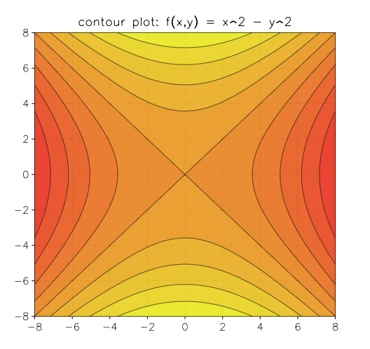

.. highlight:: lua

.. include:: <isogrk1.txt>

.. currentmodule:: graph

Contour Plots
=============

Overview
--------

GSL shell offer a contour plot function to draw contour curve of bidimensional functions. The current algorthm works correctly only for continous functions and it may gives bad results if the function have discontinuities.

Here an example of its utilisation to plot the function :math:`f(x,y) = x^2 - y^2`::

   contour.plot(|x,y| x^2 - y^2, -8, -8, 8, 8)

.. module:: contour

.. function:: plot(f, xmin, ymin, xmax, ymax[, options])

   Plot a contour plot of the function ``f`` in the rectangle delimited by (xmin, ymin), (xmax, ymax) and return the plot itself.

   The ``options`` argument is an optional table that can contain the following field:
 
   * ``gridx``, number of subdivision along x
   * ``gridy``, number of subdivision along y
   * ``levels``, number of contour levels or a list of the level values in monotonic order.
   * ``colormap`` a function that return a color for the contour region. The argument of the function will be a number between 0 and 1.
   * ``show``, specify if the plot should be shown. By default it is ``true``.

.. function:: polar_plot(f, R[, options]])

   Plot a contour plot of the function ``f(x, y)`` over the circular domain or radius ``R`` and centered at the origin. The ``options`` table accept the same field of the function :func:`contour`.

   Example::

     use 'math'

     p = contour.polar_plot(|x,y| cos(x)+cos(y)+0.1*x+0.3*y, 8)
     p.title = 'cos(x) + cos(y) + 0.1*x + 0.3*y'
   
   .. figure:: polar-contour-example-cos-cos.png
