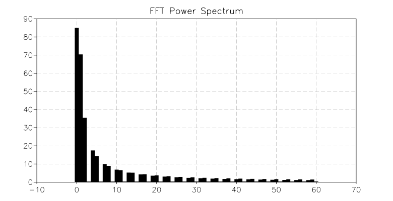

.. highlight:: lua

.. include:: <isogrk1.txt>

Fast Fourier Transform
==============================

Mathematical Definitions
------------------------

Fast Fourier Transforms are efficient algorithms for calculating the discrete fourier transform (DFT)

.. math::
     x_j = \sum_{k=0}^{n-1} z_k \exp(-2\pi i j k / n)

The DFT usually arises as an approximation to the continuous fourier
transform when functions are sampled at discrete intervals in space or
time. The naive evaluation of the discrete fourier transform is a matrix-vector multiplication :math:`W\vec{z}`. A general matrix-vector multiplication takes O(n\ :sup:`2`) operations for n data-points. Fast fourier transform algorithms use a divide-and-conquer strategy to factorize the matrix W into smaller sub-matrices, corresponding to the integer factors of the length n. If n can be factorized into a product of integers f\ :sub:`1` f\ :sub:`2` ... f\ :sub:`m` then the DFT can be computed in O(n |Sgr| f\ :sub:`i`) operations. For a radix-2 FFT this gives an operation count of O(n log\ :sub:`2` n).

All the FFT functions offer two types of transform: forwards and inverse, based on the same mathematical definitions. The definition of the forward fourier transform, ``fft(z)``, is,

.. math::
     x_j = \sum_{k=0}^{n-1} z_k \exp(-2\pi i j k / n)

and the definition of the inverse fourier transform, ``fft_inv(x)``, is,

.. math::
     z_j = {1 \over n} \sum_{k=0}^{n-1} x_k \exp(2\pi i j k / n).

The factor of 1/n makes this a true inverse.

In general there are two possible choices for the sign of the
exponential in the transform/ inverse-transform pair. GSL follows the
same convention as fftpack, using a negative exponential for the
forward transform. The advantage of this convention is that the
inverse transform recreates the original function with simple fourier
synthesis. Numerical Recipes uses the opposite convention, a positive
exponential in the forward transform.

GSL Shell interface
-------------------

When you perform a Fourier transform different routines can be used depending on the size N of the sample. GSL features two kinds of routines, radix 2 and mixed radix. The radix 2 routine can be used if the size of the sample is a power of 2 while mixed radix can be used for any size of the input data but will be "fast" only if the size can be factorized into the product of small prime numbers.

GSL Shell will select automatically the appropriate routine for you in a transparent way. But you should nevertheless be aware that the calculation will be fast only if the size of data can be factorised in small primes. You should also know that the mixed radix algorithm requires additional memory spaces so if you need to minimise memory usage you should feed only data of power of two size.

GSL shell manage automatically the additional memory of precomputed trigonometric tables that may be required by the routine. The strategy used will be very efficient if you will perform many times the Fourier Transform of data always of the *same* size. If you perform many Fourier transform always with different size you will incur in a performance penality. Please not anyway that *no additional workspaces* are needed with radix two transformations.

Fourier Transform of Real Data
------------------------------

In principle the Fourier Transform of real data is exactly the same of the Fourier transform of complex data, we only make the difference between them because:

- in GSL Shell real value matrix and complex value matrix are considered
  different types
- specialised routines exists to work efficiently in the case of real value
  data

Another important reason is *redundancy*, that is, because data are real the Fourier transform comes with a special symmetry:

.. math::
     z_k = z_{N-k}^*

so you don't need to store N complex values but only N/2.

A sequence with this symmetry is called "conjugate-complex" or
"half-complex". The results of a Fourier Transform of real data will be an half-complex array. In GSL Shell half-complex array are treated like special kind of arrays in order to be more efficient. To access element in half-complex array you can use the following functions:

.. class:: HCArray

   Store the half-complex sequence resulting from a Fourier transform on real data.

   .. method:: get(i)

      Returns the complex value of index ``i``. The index are used as follows:
      
      - 0, the value corresponding to zero frequency
      - n, with n > 0, the values corresponding to the frequency n. If the input
        is a temporal sequence of interval of index ``k`` then it corresponds
        to the term exp(-2 i k n / N)
      - -n, with n >0, the values of negative frequency -n. The resulting values
        would be always the complex conjugate of the corresponding positive
        frequency value

   .. method:: set(i, v)

      Set the complex element of index ``i`` to the value ``v``. The indexing
      rules are the same that for the method :func:`get`.

   .. attribute:: length
 
      The index of the maximum frequency. If N is the size of the
      real data it is always equal to N/2. It is useful since the domain of
      possible frequencies are:

      .. math::      
         -N/2, -N/2+1, \dots, -1, 0, 1, \dots, N/2-1, N/2

.. function:: fft(v)

   Perform the Fourier transform of a matrix column of *real*
   numbers. The transformation will be done *in place* so your data
   will be actually transformed in an half-complex array. The function
   does not return any value.  If you need to preserve the original
   data you should make a copy of your vector by doing something like::

      local f = copy(v) -- we take a copy of the vector
      fft(f) -- fourier transform is made in place

   Please note that the value you obtain is not an ordinary matrix but
   an half-complex array. You can use half-complex array only with the
   methods :func:`get` and :func:`set`. If you want to have an
   ordinary matrix you can easily build it with the following
   instructions::

      -- we suppose that f is an half-complex array
      m = cnew(f.length+1, 1, |i,j| f:get(i-1))

.. function:: fft_inv(hc)

   Perform the inverse Fourier transform of an half-complex array *in
   place*. As a result the input is transformed in a real valued
   column matrix. The factor resulting matrix does include the 1/N
   factor to ensure that the use of :func:`fft` and :func:`fft_inv`
   gives exactly the original data. Please note that some authors
   use a factor of :math:`1/\sqrt{N}` for both forward and inverse
   matrix.

   A tipical usage of :func:`fft_inv` is to revert the trasformation
   made with :func:`fft` but by doing some transformations of the
   way. So a typical usage path could be::

      -- we assume v is a column matrix with our data
      fft(v) -- fourier transform

      -- here we can manipulate the half-complex array with
      -- using the methods `get' and `set'
      some code here

      fft_inv(v) -- we perform the inverse fourier transform
      -- now v is again a column matrix of real numbers

Fourier Transform of Complex Data
---------------------------------

The Fourier transform of complex data is simpler then the one for real data because both the input and the output will be complex column matrix of the same size. The algorithm actually used will always be a mixed-radix algorithm and GSL Shell will take care of allocating the required resources. As for the real data the table allocation strategy is very efficient for the case when many fourier transforms are made always with the same size.

The Fourier trasform is made using the function :func:`cfft` that provides both direct and inverse Fourier transform.

.. function:: cfft(v[, sign])

   Perform the Fourier transform of a given complex column vector *in
   place*. The function does not return any value. If ``sign`` is
   positive a direct transformation will be done, this is the defaut
   case. If sign is negative the inverse transfrmations will be done
   and a factor 1/N will be used to scale the results.

FFT example
-----------

In this example we will treat a square pulse in the temporal domain. To illustrate a typical example of FFT usage we perform the Fourier Transform of the signal and we cut the higher order frequencies. Than we perform the inverse transform and we compare the result with the original time signal.

So, first we define our square pulse in the time domain. Actually it will be a matrix with just one column::

   n, ncut = 256, 16

   -- we create a pulse signal in the time domain
   y = new(n, 1, |i| i < n/3 and 0 or (i < 2*n/3 and 1 or 0))

Than we create two new plots, one for the Fourier transform and one for the signal itself::

   pt = plot('Original signal / reconstructed')
   pf = plot('FFT Power Spectrum')

   pt:addline(ipath(sample(|i| y[i], 1, n, n-1)), 'black')

Now we are ready to perform:

  - the Fourier transform
  - cut the higher frequencies
  - transform back the signal in the time domain

and plot the results::

   fft(y)

   pf:add(ibars(sample(|k| abs(y:get(k)), 0, 60, 60)), 'black')

   for k=ncut, n/2 do y:set(k,0) end
   fft_inv(y)

   pt:addline(filine(|i| y[i], n), 'red')

   pf:show()
   pt:show()

   Fourier transform spectrum

.. figure:: fft-example-time-signal.png

   Time signal before (black) and after (red) the transformation

You can observe in the reconstructed signal (the red curve) that we obtain approximatively the square pulse but with a lot of oscillations. Of course this is an artifact of our transformations. The reason is that in order to reproduce prefectly a sharp signal we need also all the high frequencies of the Fourier transform.
