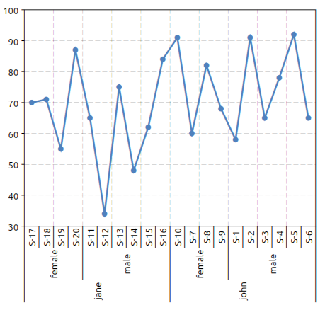

.. highlight:: lua

.. include:: <isogrk1.txt>

General Data Tables
===================

Overview
--------

General Data Tables, GDT in short, are used in GSL Shell to store data in tabular format.
They are somewhat similar to matrices but have some notable differences.

While in matrices columns are always unnamed in GDT tables they have names so that you can refer to a specific column by name.
The other important difference is that the value in each cell does not need to be numeric but can be also a string or undefined.

Since a GDT table can contain strings they are often useful to store data coming from observations or from reports.
The possibility to mark a cell as undefined is also useful to take into account missing or not available data.

Here an example of GDT table taken from the excellent `|STAT user manual <http://oldwww.acm.org/perlman/stat/handbook/handbook.html>`_ of Gary Pearlman:

   >>> ms=gdt.read_csv 'examples/exam.csv'
   >>> ms
      student teacher    sex m1 m2 final
   1      S-1    john   male 56 42    58
   2      S-2    john   male 96 90    91
   3      S-3    john   male 70 59    65
   4      S-4    john   male 82 75    78
   5      S-5    john   male 85 90    92
   6      S-6    john   male 69 60    65
   7      S-7    john female 82 78    60
   8      S-8    john female 84 81    82
   9      S-9    john female 89 80    68
   10    S-10    john female 90 93    91
   11    S-11    jane   male 42 46    65
   12    S-12    jane   male 28 15    34
   13    S-13    jane   male 49 68    75
   14    S-14    jane   male 36 30    48
   15    S-15    jane   male 58 58    62
   16    S-16    jane   male 72 70    84
   17    S-17    jane female 65 61    70
   18    S-18    jane female 68 75    71
   19    S-19    jane female 62 50    55
   20    S-20    jane female 71 72    87

As you can see in this case the data is loaded from a CSV file. In the first line the name of each column is shown and the data follow in a tabular form.

In the example above the columns are either numeric of textual but in reality there is nothing to enforce the type of a column.
Each column can mix freely numbers or strings or even undefined values without restrictions.

As a general rule the functions that need to know if a column is purely numeric or if it does contain text always looks at the content of the column to decide its type.

As you can imagine there are many functions available to operate of a GDT table.
They can be grouped into families:

* functions to manipulate tables
* functions to create plots based on the table's data
* functions to perform statistical computations

The the chapter :ref:`GDT plots <gdt-plot>` you will find an introductions to plotting functions.
In the chapter about :ref:`Linear Models <gdt-lm>` the function :func:`gdt.lm` in described in details.
The function :func:`gdt.lm` is very function to analyze data in term of a linear model.
You can think it as a generalization of the familiar linear regression of the form :math:`y = a \, x + b`.

The function :func:`gdt.filter` and :func:`gdt.reduce` are also very useful to manipulate tables in a similar way to what you can do with spreadsheet applications.

GDT Functions
-------------

.. module:: gdt

.. function:: new(n, m)
              new(n, headers)

   Create a new data table with ``n`` rows and ``m`` columns.
   In the second form a table is provided with the column's names.

.. function:: alloc(n, m)
              alloc(n, headers)

   Like the function :func:`gdt.new` but the table data is not initialized.
   It is left to the user to set the values for each rows and columns.

.. function:: create(f_init, a, b)
              create(f_init, b)

   Create a new GDT table based using the function ``f_init(i)`` for ``i`` going from ``a`` to ``b``.
   In the second form ``a`` defaults to 1.
   The function ``f_init`` should return, for each value of "i", a table in the form ``{field1= <expr>, field2= <expr>, ...}``.
   The GDT table will be created filling each rows with the provided expressions.
   For each named field a column will be created in the table.

   For example let us create a table that computes the value of :math:`\sin(x)` and :math:`\cos(x)` for x going from 0 to :math:`2 \pi`.
   This can done with :func:`gdt.create` like in the following example::

      >>> use 'math'
      >>> n = 16 -- # of sampling points
      >>> x = |i| (i-1)*2*pi/n -- sampling function
      >>> t = gdt.create(|i| {x = x(i), sin = sin(x(i)), cos = cos(x(i))}, n)
      >>> t
                 sin        x          cos
      1            0        0            1
      2     0.382683 0.392699      0.92388
      3     0.707107 0.785398     0.707107
      4      0.92388   1.1781     0.382683
      5            1   1.5708  6.12303e-17
      6      0.92388   1.9635    -0.382683
      7     0.707107  2.35619    -0.707107
      8     0.382683  2.74889     -0.92388
      9  1.22461e-16  3.14159           -1
      10   -0.382683  3.53429     -0.92388
      11   -0.707107  3.92699    -0.707107
      12    -0.92388  4.31969    -0.382683
      13          -1  4.71239 -1.83691e-16
      14    -0.92388  5.10509     0.382683
      15   -0.707107  5.49779     0.707107
      16   -0.382683  5.89049      0.92388

.. function:: filter(t, f)

    Returns a new table obtained from ``t`` by filtering the rows selon the predicate function ``f``.
    The predicate function will be called for each row with two arguments: ``f(r, i)`` where the first is a cursor pointing to the current row and the second is the index.
    The row will be retained if and only if the predicate function returns true.

.. function:: reduce(t, description)

    Returns a new table with aggregate partial results for table ``t`` based on ``description``.
    This latter should be a string and has the same meaning of the plot description string described in the :ref:`GDT Plot <gdt-plot>` chapter.

    The general form of the description string is ``"<func1>(<expr1>), <func2>(<expr2>), ... ~ x1, x2, ..., xn | e1, e2, ..., en"``.
    The functions will be used to compute the aggregate value for a given instance of x1, x2, ..., xn and e1, e2, ..., en.
    The available aggregate functions are "mean", "stddev", "stddevp", "var", "count", "sum".

    Example to compute some averages and std deviations::

       >>> t = gdt.read_csv 'examples/exam.csv'
       >>> gdt.reduce(t, "mean(final), stddev(final), mean((m1+m2)/2) ~ teacher, sex")
         teacher    sex mean(final) stddev(final) mean((m1+m2)/2)
       1    jane female       70.75       13.0735            65.5
       2    jane   male     61.3333       18.1071         47.6667
       3    john female       75.25       13.8894          84.625
       4    john   male     74.8333       14.4418         72.8333

    The meaning of the description string is: for each teacher and sex compute the mean and the standard deviation of the "final" score and the average of m1 and m2 (midterm's scores).

    If you call the function :func:`gdt.barplot` with the same arguments you will obtain the following plot:

    .. figure:: gdt-reduce-exam-example-plot.png

    The plot above correspond actually to the table obtained with :func:`gdt.reduce`. Both functions perform the same operations, the only difference is that :func:`gdt.reduce` will create a table while the function :func:`gdt.barplot` will create a plot.

.. function:: lm(t, model_descr, options)

    Perform a linear fit of the data in the table ``t`` based on the model described with ``model_descr``.
    This latter should be a string of the form ``"y ~ x1, x2^2"`` where the variables referenced are column's names of the table.
    For more details about the model description look in the section on :ref:`GDT linear model <gdt-lm>`.
    The options are documented in the paragraph about :ref:`linear model options <gdt-lm-opts>`.

.. function:: plot(t, plot_spec[, options])

    Make a plot of the data in the table ``t`` based on the plot description ``plot_desc``.
    For more details about the plot description look in the section on :ref:`GDT plots <gdt-plot>`.
    The options are documented in the paragraph about :ref:`plotting options <gdt-plot-opts>`.

.. function:: barplot(t, plot_spec[, options])

    Make a bar plot of the data in the table ``t`` based on the plot description ``plot_desc``.
    The meaning of the plot description strings and the options are the same of the function :func:`gdt.plot`.

.. function:: boxplot(t, plot_spec[, options])

    Make a boxplot of the data in the table ``t`` based on the plot description ``plot_desc``.
    The meaning of the plot description strings and the options are the same of the function
    :func:`gdt.plot` but without using statistical functions like described in :ref:`GDT Plots <gdt-plot-stat-functions>`.

    Below an example of boxplot:

       >>> exam = gdt.read_csv 'examples/exam.csv'
       >>> gdt.boxplot(exam, "final ~ teacher | sex")

    giving the plot:

    .. figure:: gdt-boxplot-example-exam.png

    The quartiles are computed according to Hyndman, Rob & Fan, Yanan (1996), computation type 8.

.. function:: read_csv(filename)

    Read a file in CSV format (Comma Separated Values) and return a GDT table.
    If the file have headers they will be used to define the columns' names.
    The function will determine automatically is the first line should be considered as a line of headers or data.

.. function:: read_string(text)

    Returns a table by parsing the text as a multi-lines list of values separated by spaces
    or tabs. Values can be either string or numeric values. In case
    of strings they can be either unquoted or quoted using the ``"`` symbol.
    If the first non empty line consists entirely of string it is interpreted as headers.

    Below an example:

      >>> t = gdt.read_string [[
                 sin        x          cos
                 0        0            1
          0.382683 0.392699      0.92388
          0.707107 0.785398     0.707107
           0.92388   1.1781     0.382683
                 1   1.5708  6.12303e-17
           0.92388   1.9635    -0.382683
          0.707107  2.35619    -0.707107
          0.382683  2.74889     -0.92388
       1.22461e-16  3.14159           -1
         -0.382683  3.53429     -0.92388
         -0.707107  3.92699    -0.707107
          -0.92388  4.31969    -0.382683
                -1  4.71239 -1.83691e-16
          -0.92388  5.10509     0.382683
         -0.707107  5.49779     0.707107
         -0.382683  5.89049      0.92388
      ]]

.. function:: from_table(data, headers)

   Creates a data table using the given `data` and `headers`.
   The argument `data` should be a table and each element a table with a fixed number of
   elements equal to the nuber of elements in `headers`.

.. function:: write_csv(t, filename)

    Write a CSV file with the given ``filename`` with the content of the table ``t``.

.. function:: interp(t, description[, interp_method])

    Return a function that perform an interpolation based of the data in the table ``t`` and the ``description`` string.
    The description should be of the form ``"y ~ x"`` where "y" and "x" are variables defined in the table.

    Given the set of data points :math:`(x_1, y_1) \dots (x_n, y_n)` the routines described in this section compute a continuous interpolating function :math:`y(x)` such that :math:`y(x_i) = y_i`. The interpolation is piecewise smooth, and its behavior at the end-points is determined by the type of interpolation used.

    The interpolation method is specified by the optional argument ``interp_method``.
    The accepted methods are "linear", "polynomial", "cspline", "cspline_periodic", "akima", "akima_periodic".
    The default method is "cspline" if none is specified.

.. function:: integrate(t, description[, x1, x2])

    Perform the integration of one of several y variables of a single x variable based on the
    values in the table ``t`` and ``description``, a string in the form: ``"y1, y2 ~ x"``.

    The optional arguments `x1` and `x2` provides the integration limits but if omitted the first
    and last value in the table will be used.

    It is generally expected that the x values increase monotonically.

.. function:: sampling_optimize(t, x_name, y_names, eps_rels)

    Returns a new data table by optimizing the sampling points over the variable `x_name`
    so that for each of the list of variables `y_names` a linear interpolation would not
    introduce an error greater then the corresponding relative tolerances `eps_rels`.

    The argument `y_names` should be table with a list of names or a string with a single
    variable name.
    The argument `eps_rels` should have the same form and number of terms and its values should
    be positive numbers corresponding to the relative tolerance.

.. function:: select_interval(t, x_name, x1, x2)

    Returns a new tables by selecting the entries that meet the condition on `x_name` of
    being within `x1` and `x2`.

GDT Methods
-----------

.. class:: Gdt

  .. method:: dim()

     Return the numbers of rows and of columns of the table.

  .. method:: get(i, j)
              get(i, name)

     This function returns the (i,j)-th element of a table.
     As for the matrices the indexes starts from 1.
     In the second form the column's name can be used.
     The returned value can be either a number, a string or "nil" in case of undefined value.

  .. method:: set(i, j, v)
              set(i, name, v)

     This function sets the value of the (i,j)-th element of the table to v.
     The name of the column can be given instead of the column's index.

  .. method:: header(j)

     Return the column's name of the j-th column of the table.

  .. method:: set_header(j, name)

     Set the column's name of the j-th column of the table to the given name.

  .. method:: column(j)
              column(name)

     Return an iterator that gives, at each iterations, the couple (i, v) representing the index and the value of each cell in the column j.

  .. method:: col_index(name)

     Return the column index corresponding to the given name.

  .. method:: col_insert(name, j[, f_init])

     Insert a new column named ``name`` at the given index.
     The function ``f_init`` is called for each row of the table to intialize the column's value.
     The function is called in the form ``f_init(r, i)`` where the argument ``r`` passed to ``f_init`` contains the values in the current row indexed by the column's name.
     If the initialized function is not provided the values will be initialized to ``NA``.

     For example if we have a table with two columns named ``x`` and ``y`` we can define a new column with their average with the following code::

        t:col_insert("average", 3, |r| (r.x + r.y) / 2)

  .. method:: col_append(name[, f_init])

     Append a new column named ``name``.
     The function ``f_init`` is called for each row of the table to intialize the column's value.
     The function is called in the form ``f_init(r, i)`` where the argument ``r`` passed to ``f_init`` contains the values in the current row indexed by the column's name.
     If the initialized function is not provided the values will be initialized to ``NA``.

     For example if we have a table with two columns named ``x`` and ``y`` we can define a new column with their average with the following code::

        t:col_append("average", |r| (r.x + r.y) / 2)

  .. method:: col_define(name[, f_init])

     Like the method :meth:`~Gdt.col_append` with the exception that, if a column with the given name already exists, it will be overwritten with the new values.

  .. method:: insert(i[, values])

     Insert a new row at the given index ``i``.
     The second argument, if given, will be used to initialize the new row for each column by taking ``values[key]`` where ``key`` is the column's name.
     If the second argument is not provided the values will be initialized to ``NA``.

     For example if we have a table with two columns named ``x`` and ``y`` we can insert a new row at index 1 as follows::

        t:insert(1, {x = 3.2, y = 0.7})

  .. method:: append([values])

     Append a new row at the end of the table.
     The initialization of the values is done using the optional argument like for the :meth:`~Gdt.insert` method.

     If the second argument is not provided the values will be initialized to ``NA``.

     For example if we have a table with two columns named ``x`` and ``y`` we can insert a new row at the end of the table as follows::

        t:append {x = 3.2, y = 0.7}

  .. method:: cursor()

     Return an object of type cursor.
     It does intially point to the first row of the table.
     A cursor object can be indexed with the name of the columns to obtain the correponding value for the current row.

  .. method:: rows()

     Return an iterator to span all the rows of the table.
     At each iteration the row index is provided and a cursor pointing to the current row.

     For example to print the element ``x`` and ``y`` for each row of a table::

        for i, cursor in t:rows() do
           print(cursor.x, cursor.y)
        end

  .. method:: headers()

     Returns a table with the name of the columns (headers).
     The values are given in the column's order so that the index of each element corresponds to the index of the given column in the table.

  .. method:: levels(j)
              levels(column_name)

     Returns a list of the unique levels for the given column identified by its index ``j`` or its name.

.. _gdt-plot:

GDT Plots
---------

With GSL Shell it is relatively easy to plot data from a GDT table based on the name of the columns.
A mini language is used to express the type of plot that should be realized.
In this chapter we will illustrate its usage with some examples.

Let us use the following data for our example:

   >>> ms = gdt.read_csv('examples/am-women-weight.csv')
   >>> ms
      height weight
   1    1.47  52.21
   2     1.5  53.12
   3    1.52  54.48
   4    1.55  55.84
   5    1.57   57.2
   6     1.6  58.57
   7    1.63  59.93
   8    1.65  61.29
   9    1.68  63.11
   10    1.7  64.47
   11   1.73  66.28
   12   1.75   68.1
   13   1.78  69.92
   14    1.8  72.19
   15   1.83  74.46

As you can see the table above have two columns named "height" and "weight".
We may want to make a scatterplot of the data to see how the weight varies with the height.
In order to make such plot we can just use the function :func:`gdt.plot` ::

   gdt.plot(ms, "weight ~ height")

The formula provided as a second argument tells to the function that the variable "weight" should be plotted versus the variable "height".

The function :func:`gdt.plot` can create even more complex plots when dealing with tables with enumeration variables.
Let us cover a more complex example with another set of data::

   >>> ms=gdt.read_csv 'examples/exam.csv'
   >>> ms
      student teacher    sex m1 m2 final
   1      S-1    john   male 56 42    58
   2      S-2    john   male 96 90    91
   3      S-3    john   male 70 59    65
   4      S-4    john   male 82 75    78
   5      S-5    john   male 85 90    92
   6      S-6    john   male 69 60    65
   7      S-7    john female 82 78    60
   8      S-8    john female 84 81    82
   9      S-9    john female 89 80    68
   10    S-10    john female 90 93    91
   11    S-11    jane   male 42 46    65
   12    S-12    jane   male 28 15    34
   13    S-13    jane   male 49 68    75
   14    S-14    jane   male 36 30    48
   15    S-15    jane   male 58 58    62
   16    S-16    jane   male 72 70    84
   17    S-17    jane female 65 61    70
   18    S-18    jane female 68 75    71
   19    S-19    jane female 62 50    55
   20    S-20    jane female 71 72    87

In the table above we have some numerical columns, "m1", "m2" and "final" while the other three columns are not numerical.
In this case we can still use the plot function that will automatically display the variable as an enumeration.
So, fox example, we can do a plot using the function::

   gdt.plot(ms, "final ~ teacher, sex, student")

to obtain the following plot:

We have just adjusted the orientation of the x axis' labels with the command::

   >>> _.xlab_angle=math.pi/2

In this latter example we have given a formula with *three* variables on the right of the "~" symbol.
The meaning is that we want to plot the "final" variable versus the "teacher", "sex" and the "student" variables.

It is interesting to note that if the "student" variable was omitted the plot function would have plotted the average score for each teacher and sex combination.
These means that, when more entries correspond to a single plotting value the average of the values is used.

.. _gdt-plot-stat-functions:

This behavior can be made explicit by using the "mean" function which is otherwise implicit::

   gdt.plot(ms, "mean(final) ~ teacher, sex, student")

Other functions like "stddev" and "count" are available to deal with multiple values.
The function "stddev" can be especially useful to easily plot the standard deviation of grouped data.

At this point we may want to switch to a barplot to plot the results.
This can be done using the function :func:`gdt.barplot`.
This latter function can be used in exactly the same way that the function :func:`gdt.plot` so you can switch between them without changing the formula.

In this case we may want to plot both the final score and the "m2" score (mid term score).
This can be done easily with the following formula::

   gdt.barplot(ms, "final, m2 ~ teacher, sex, student")

to obtain the plot below:

.. figure:: gdt-plot-exam-m2-final.png

Now let use suppose that we want to drop the "student" variable to obtain the average score for each teacher and sex possible combinations.
The plot can be done using the following expression::

   gdt.barplot(ms, "final ~ teacher | sex")

to obtain the plot below:

.. figure:: gdt-plot-exam-by-sex.png

In this case we have used the "|" symbol.
The idea is that all the variables on the right of the "|" will be enumerated with different colors and different symbols depending on the plot.
A legend will be also added to link each color with each enumerated value.
We will refer to the variables or the right of the "|" as an "enumeration variables".

The enumeration variables are useful for all kind of plots.
In the case of line plots enumerated plots are handy to obtain different lines with different colors plotted over the same variables.

We want to illustrate now how to *filter* the data to be plotted on the fly.
The filter is given in the form of a logical relation specifid after a colon ':' character.
Only the rows satisfying the given relation will be included in the plot.

To illustrate plot's filters we will use the data from the Julia language benchmark.
In the benchmark data there is a column "language" that identifies the programming language and a column "test" that identifies the specific benchmark test.
Now let us suppose that you want to plot only the results for the "mandel" test.
You can do it by using the plot filters like in the example below::

   >>> ms=gdt.read_csv 'examples/perf-julia.csv'
   >>> gdt.barplot(ms, "log(time.c) ~ language : test = 'mandel'")

to obtain the following plot:

.. figure:: gdt-plot-perf-filter-mandel.png

In this case you can note that the string ``'mandel'`` is enclosed using the single quotes characters.
This is required because otherwise the expression is interpreted as a column's name.

In addition we have also used the ``log`` function.
When you describe a plot you can actually use any function contained in the standard "math" module.

The relation operators available are: ``>``, ``<``, ``>=``, ``<=``, ``=``, ``!=``.
More conditions can be given, separated by a comma, to filter the data.
In addition the logical operators 'and' and 'or' can be used to combine the logical relations.

Histogram plots
---------------

Histogram plots can be created using the function :func:`gdt.hist`.
Its usage is simple, you just need to give the tables and an expression whose values will be plotted in the form of an histogram.

Here an example of the kind of plot that you can obtain:

.. figure:: gdt-hist-example.png

Currently the histogram function does not support any option but this may change in future.
The histogram breaks are calculated accordingly to the Freedman-Diaconis rule.

.. _gdt-plot-opts:

Plotting options
----------------

Plotting options are passed in the form of a table as the last arguments.
The table should be of the form ``{option_1= value_1, option_2= value_2, ...}``.

The options accepted by plots are:

* ``show``, if false the plot will not be shown, default to true
* ``lines``, if true lines will be used for the plot
* ``points``, if true points markers will be used for the plot

.. _gdt-lm:

GDT Linear Model
----------------

The linear model function :func:`gdt.lm` is a generic function to perform a linear least square fit based on a linear model description.

It does return a special type of object that store the result of the fit.
The fit object can be used to print a summary or performing other operations like evaluating the predicted values. The details about the fit objects are given in the :ref:`fit objects <gdt-fit-obj>` specific section.

The linear fit is performed accordingly to the model string.
This latter should be of the form:

  y ~ factor1, factor2, ...

where ``y`` is the indipendent variables.

In general you can refer to the data present in the table by using the column's name.

The factors that appears on the right hand side can be just variable names or a derived expression.
All the arithmetic operations can be used plus the functions present the the "math" module.

The linear model procedure classify the factors in two classes:

  - *enumeration factors*, by default any column that contains string
  - *scalar factors*, purely numerical columns

A column can be forced to be considerd as an *enumeration factor* by using the ``%`` prefix operator.

The *enumeration factors* are treated differently by the linear model procedure.
For each enumeration factor the possible levels are enumerated based on the table.
The first level is chosen as a reference and a coefficient is added in the fit for each other level.
The enumeration can have a scalar part that multiply the coefficient in the model.
For purely enumeration factors the scalar part is equal to 1.

In mathematical terms the more general linear fit form is given by the formula:

.. math::
     f_i = \sum_{k} a_k \, A_{k i} + \sum_{k} \sum_{p = 1}^{P_k} b_{k p} F_{k p i} B_{k i}

where :math:`A_{k i}` is the matrix of the scalar factors, :math:`B_{k i}` is the matrix of the scalar part of the enumeration factors and :math:`F_{k p i}` is the "level matrix".
The index :math:`p` will assume the values :math:`1, ..., P_k` where :math:`P_k` are the number of levels for the k-th enumerated factor.
The value :math:`F_{k p i}` will be always equal to 1 for :math:`p = 1` since the first level is taken as a reference.
For the other levels :math:`F_{k p i}` will be 1 if the level in the i-th row match the p-level and 0 otherwise.
The coefficient determined by the fit are :math:`a_k` and :math:`b_{k p}` for the scalar and enumerated factors respectively.
The index ``i`` span each row in the tables by excluding only rows where one of the factors or the observation is undefined.

For example, in the case of a linear fit of the form:

.. math::
     y = a + b x

let us suppose that in our table we have two columns named "x" and "y".
In this case we can make the fit by using the model:

    "y ~ 1, x"

and the general mathematical form given above simplifies to:

.. math::
     y_i = a_1 \cdot 1 + a_2 \, x_i

since only two scalar factors are used.
In this case the model matrix has two columns, the first identically equal to 1 and the second equal to the ``x`` column.

For this fit we could have omitted the scalar factor ``1`` as it is automatically added from the ``x`` factor.
In general for each expression factor all the multiplicative factor of inferior degree are added.
So, for example, if you add a factor ``"x * z^2"`` the factors ``1``, ``x``, ``z``, ``z^2`` will be automatically added.

GDT linear fit example
~~~~~~~~~~~~~~~~~~~~~~

In this example we illustrate the more general case of linear model with scalar and enumerated factors.

Let us suppose that we have a measured quantity ``y`` taken at different moment of time ``t``.
We suspect that the speciman evolve with time and ``y`` varies linearly with ``t``.

In addition let us suppose that we have three different tools, "tool A", "tool B" and "tool C" and we suspect they are not matched.

Here a extract of how the data table will look like::

   >>> ms = gdt.read_csv('examples/metro-lm-example.csv')
   >>> ms
        tool   t        y
   1  tool A   0  2.74018
   2  tool A 0.1  2.79357
   3  tool A 0.2  3.44232
   4  tool A 0.3  3.28009
   5  tool A 0.4  3.47926
   6  tool A 0.5  2.91675
   7  tool A 0.6  2.70099
   ...
   31 tool B   0  2.93806
   32 tool B 0.1  3.04179
   33 tool B 0.2  3.19853
   34 tool B 0.3  2.59698
   35 tool B 0.4  3.65323
   36 tool B 0.5  3.58917
   37 tool B 0.6  3.65215
   38 tool B 0.7   4.0545
   ...
   61 tool C   0 0.928787
   62 tool C 0.1  1.22095
   63 tool C 0.2  1.21612
   64 tool C 0.3  1.19774
   65 tool C 0.4  1.06587
   ...

Based on out knowledge we suspect that the data can be explained with a linear model of the form:

.. math::
      y_i = a + b \, t_i + \delta_p F_{p i}

where :math:`a_i` and :math:`b_i` are the linear coefficient and :math:`\delta_p` are the coefficients for the levels of the enumerated factor, the tool.
These latter describe de tool effect by taking "tool A" as a reference so that
``p`` can take two values: 1, 2 for tools B et C respectively.

The expression :math:`F_{p i}` is equal to 1 when the tool in the i-th column correspond to the tool "p" and 0 otherwise.
Therefore the coefficients :math:`\delta_1` and :math:`\delta_2` represents the average delta of tools "B" and "C" versus the tool "A".

Here a way to perform the linear fit and make a plot of the data::

  -- make a plot of the data
  p = gdt.plot(t, "y ~ t | tool", {show= false})

  -- set plot's titles
  p.title = "Linear Fit example"
  p.xtitle = "time, s"
  p.ytitle = "thickness, mm"

  -- perform a linear model fit
  fit = gdt.lm(t, "y ~ t, tool")
  fit:summary()

  -- add into the plot the lines representing the predicted values
  -- by tool
  for k = 1, P do
    local ln = graph.fxline(|t| fit:eval {tool= tools[k], t= t}, 0, 3.0)
    p:addline(ln, graph.webcolor(k), {{'dash', 7, 3}})
  end

  p:show()

You can note that the function :func:`gdt.lm` return a "fit" object.
This latter is important because it does store the result of the fit.
More specifically its :meth:`~Fit.summary` will print a summary of the results::

  >>> fit:summary()
          term estimate std error  t value     Pr(>|t|)
  1          1  2.68767 0.0816757  32.9067      < 2e-16
  2          x  1.17714 0.0391605  30.0594      < 2e-16
  3 tooltool B 0.417387 0.0830258  5.02719 2.68273e-006
  4 tooltool C -1.61441 0.0830258 -19.4447      < 2e-16

  Standard Error: 0.321557, R2: 0.948122, Adjusted R2: 0.94568

In the table above a summary of the fit result is presented including the estimated coefficients with their standard errors and the "t values".
At the bottom the residual R square of the fit and the residual standard error are given.

Later we use the :meth:`~Fit.eval` method to trace the predicted line to obtain the following plot:

.. figure:: gdt-lm-plot-example.png

It is interesting to note that the tool effect can be taken into account with a different model where the "time" and "tool" effect are crossed::

  fit = gdt.lm(t, "y ~ t * tool")

In this case the regression function will take into account three effects:

  * the "time" linear effect
  * the tool effect
  * a tool effect on the time coefficient

So the difference from the example made before would be that, for each tool, a different coefficient is evaluated.

The corresponding model would be:

.. math::
      y_i = a + b \, t_i + (\delta_p + c \, t_i) F_{p i}

so that a different linear coefficient is attributed to each tool.

.. _gdt-fit-obj:

GDT Fit Object
~~~~~~~~~~~~~~

.. class:: LMFit

   A fit object is returned by the function :func:`gdt.lm` and store the result of a linear fit.

   .. method:: summary()

      Print a summary of the fit results with some statistical informations.

      Example::

        >>> fit = gdt.lm(t, "y ~ x, tool")
        >>> fit:summary()
                term estimate std error  t value    Pr(>|t|)
        1          1  2.68767 0.0816757  32.9067     < 2e-16
        2          x  1.17714 0.0391605  30.0594     < 2e-16
        3 tooltool B 0.417387 0.0830258  5.02719 2.68273e-06
        4 tooltool C -1.61441 0.0830258 -19.4447     < 2e-16

        Standard Error: 0.321557, R2: 0.948122, Adjusted R2: 0.94568

      In the table the coefficient estimated are shown with the associated standard error, t value and t value probability.
      This latter is a test that can help to determine if the effect is significative.

      In the last row the residual standard error is reported with the fit's R square.

   .. method:: eval(data)

      Return the predicted value based on the provided ``data``.
      This latter should be a table whose field match the variables' names used in the model.

      Example::

         fit = gdt.lm(t, "y ~ time, site | tool")
         fit.eval({time= 20.5, site= 1, tool= "Tool A"})

   .. method:: model(t)

      Return the model matrix associated with the given fit method and a given data table.
      This latter can be different from the table used for the fit.
      The obtained matrix can be used, for example, with the function :func:`num.linfit`.

   .. method:: predict(t)

      Return a column matrix with the predicted values for the given data table.
      This latter can be different from the table used for the fit.

   .. attribute:: SE

      The residual standard error of the fit.

   .. attribute:: R2

      The R square of the fit.

   .. attribute:: R2_adj

      The adjusted R square of the fit.

.. _gdt-lm-opts:

GDT Linear Model Options
~~~~~~~~~~~~~~~~~~~~~~~~

The options accepted by the :func:`gdt.lm` functions are:

  - **predict**, a boolean value, if true a column will be added to the table with the predicted value.
