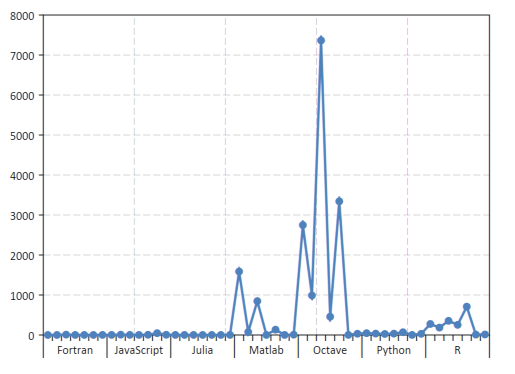
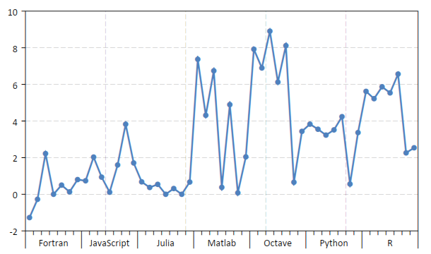
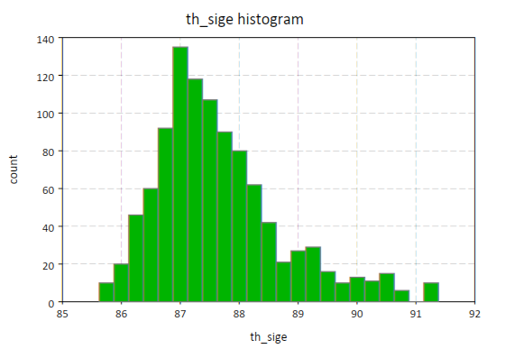
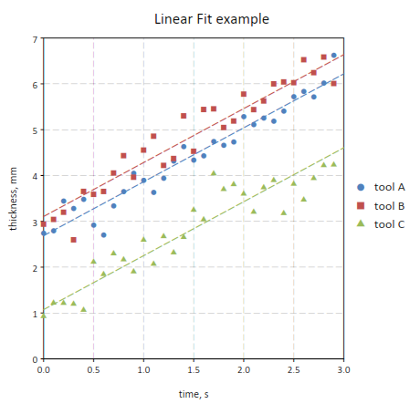

.. highlight:: lua

.. include:: <isogrk1.txt>

General Data Tables
===================

Overview
--------

General Data Tables, GDT in short, are used in GSL Shell to store data in tabular format.
They are similar to matrices but with some notable differences:

* columns have a name defined in the table's headers
* each cell can contain either a number, a string or an undefined value.

Since a GDT table can contain strings they are ofter useful to store data coming from observations or from reports.
The possibility to mark as undefined the cell's value is also useful to take into account missing data.

Here an example of a GDT table:

   >>> ms = gdt.read_csv("examples/perf-julia.csv")
   >>> ms
               test   language  time.c
   1            fib    Fortran    0.28
   2      parse_int    Fortran    9.22
   3      quicksort    Fortran    1.65
   4         mandel    Fortran    0.76
   5         pi_sum    Fortran       1
   6  rand_mat_stat    Fortran    2.23
   7   rand_mat_mul    Fortran    1.14
   8            fib      Julia    1.97
   9      parse_int      Julia    1.72
   10     quicksort      Julia    1.37
   11        mandel      Julia    1.45
   12        pi_sum      Julia       1
   13 rand_mat_stat      Julia    1.95
   14  rand_mat_mul      Julia       1
   15           fib     Python   46.03
   16     parse_int     Python   25.29
   ...

As you can see in this case the data is loaded from a CSV file. In the first line the headers are shown.

There are many functions available to operate of a GDT table.
The functions can be grouped into families:

* functions to manipulate tables
* functions to create plots based on the table itself
* functions to perform statistical computations

The more common are probably the methods :meth:`~Gdt.get` and :meth:`~Gdt.set` to operate on the table's elements on a given row and column.

GDT Functions
-------------

.. module:: gdt

.. function:: new(n, m)
              new(n, headers)

   Create a new data table with ``n`` rows and ``m`` columns.
   In the second form a table is provided with the column's names.

.. function:: filter(t, f)

    Returns a new table obtained from ``t`` by filtering the rows selon the predicate function ``f``.
    The predicate function will be called for each row with two arguments: ``f(r, i)`` where the first is a cursor pointing to the current row and the second is the index.
    The row will be retained if and only if the predicate function returns true.

.. function:: lm(t, model_descr, options)

    Perform a linear fit of the data in the table ``t`` based on the model described with ``model_descr``.
    This latter should be a string of the form ``"y ~ x1, x2^2"`` where the variables referenced are the column's name of the table.
    For more details about the model description look in the section on :ref:`GDT linear model <gdt-lm>`.
    The options are documented in the paragraph about :ref:`linear model options <gdt-lm-opts>`.

.. function:: plot(t, plot_spec[, options])

    Make a plot of the data in the table ``t`` based on the plot description ``plot_desc``.
    For more details about the plot description look in the section on :ref:`GDT plots <gdt-plot>`.
    The options are documented in the paragraph about :ref:`plotting options <gdt-plot-opts>`.

.. function:: barplot(t, plot_spec[, options])

    Make a bar plot of the data in the table ``t`` based on the plot description ``plot_desc``.
    The meaning of the plot description strings and the options are the same of the function :func:`gdt.plot`.

.. function:: read_csv(filename)

    Read a file in CSV format (Comma Separated Values) and return a GDT table.
    If the file have headers they will be used to define the columns' names.
    The function will determine automatically is the first line should be considered as a line of headers or data.

.. function:: write_csv(t, filename)

    Write a CSV file with the given ``filename`` with the content of the table ``t``.

GDT Methods
-----------

.. class:: Gdt

  .. method:: dim()

     Return the numbers of rows and of columns of the table.

  .. method:: get(i, j)
              get(i, name)

     This function returns the (i,j)-th element of a table.
     As for the matrices the indexes starts from 1.
     In the second form the column's name can be used.
     The returned value can be either a number, a string or "nil" in case of undefined value.

  .. method:: set(i, j, v)
              set(i, name, v)

     This function sets the value of the (i,j)-th element of the table to v.
     The name of the column can be given instead of the column's index.

  .. method:: header(j)

     Return the column's name of the j-th column of the table.

  .. method:: set_header(j, name)

     Set the column's name of the j-th column of the table to the given name.

  .. method:: column(j)
              column(name)

     Return an iterator the gives, at each iterations, the couple (i, v) representing the index and the value of each cell in the column j.

  .. method:: col_index(name)

     Return the column index corresponding to the given name.

  .. method:: insert(name, j[, f_init])

     Insert a new column named ``name`` at the given index.
     The function ``f_init`` is called for each row of the table to intialize the column's value.
     The function is called in the form ``f_init(r, i)`` where the argument ``r`` passed to ``f_init`` contains the values in the current row indexed by the column's name.
     If the initialized function is not provided the values will be initialized to ``NA``.

     For example if we have a table with two columns names ``x`` and ``y`` we can define a new column with their average with the following code::

        t:insert("average", 3, |r| (r.x + r.y) / 2)

.. method:: append(name[, f_init])

     Append a new column named ``name``.
     The function ``f_init`` is called for each row of the table to intialize the column's value.
     The function is called in the form ``f_init(r, i)`` where the argument ``r`` passed to ``f_init`` contains the values in the current row indexed by the column's name.
     If the initialized function is not provided the values will be initialized to ``NA``.

     For example if we have a table with two columns names ``x`` and ``y`` we can define a new column with their average with the following code::

        t:append("average", |r| (r.x + r.y) / 2)

.. method:: define(name[, f_init])

     Like the method :meth:`~Gdt.append` with the exception that, if a column with the given name already exists, it will be overwritten with the new values.

.. method:: cursor()

     Return an object of type cursor.
     It does intially point to the first row of the table.
     A cursor object can be indexed with the name of the columns to obtain the correponding value for the current row.

.. method:: rows()

     Return an iterator to span all the rows of the table.
     At each iteration the row index is provided and a cursor pointing to the current row.

     For example to print the element ``x`` and ``y`` for each row of a table::

        for i, cursor in t:rows() do
           print(cursor.x, cursor.y)
        end

.. method:: headers()

     Returns a table with the name of the columns (headers).
     The value are given in the column order so that the index of each element corresponds to the index of the given column in the table.

.. method:: levels(j)
            levels(column_name)

     Returns a list of the unique levels for the given column identified by its index ``j`` or its name.

.. _gdt-plot:

GDT Plots
---------

With GSL Shell it is relatively easy to plot data from a GDT table based on the name of the columns.
A mini language is used to express the type of plot that should be realized.
In this chapter we will illustrate its usage with some examples.

Let us use the following data for our example:

   >>> ms = gdt.read_csv('examples/am-women-weight.csv')
   >>> ms
      height weight
   1    1.47  52.21
   2     1.5  53.12
   3    1.52  54.48
   4    1.55  55.84
   5    1.57   57.2
   6     1.6  58.57
   7    1.63  59.93
   8    1.65  61.29
   9    1.68  63.11
   10    1.7  64.47
   11   1.73  66.28
   12   1.75   68.1
   13   1.78  69.92
   14    1.8  72.19
   15   1.83  74.46

As you can see the table above have two columns names "height" and "weight".
We may want to make a scatterplot of the data to see how the weight varies with the height.
In order to make such plot we can just use the function :func:`gdt.plot` ::

   gdt.plot(ms, "weight ~ height")

The formula provided as a second argument tell to the function that variable "weight" should be plotted versus the variable "height".

The function :func:`gdt.plot` can create even more complex plots when dealing with tables with enumeration variables.
Let us cover a more complex example with another set of data::

   >>> ms = gdt.read_csv('examples/perf-julia.csv')
   >>> ms
               test   language  time.c
   1            fib    Fortran    0.28
   2      parse_int    Fortran    9.22
   3      quicksort    Fortran    1.65
   4         mandel    Fortran    0.76
   5         pi_sum    Fortran       1
   6  rand_mat_stat    Fortran    2.23
   7   rand_mat_mul    Fortran    1.14
   8            fib      Julia    1.97
   9      parse_int      Julia    1.72
   10     quicksort      Julia    1.37
   11        mandel      Julia    1.45
   12        pi_sum      Julia       1
   13 rand_mat_stat      Julia    1.95
   14  rand_mat_mul      Julia       1
   15           fib     Python   46.03
   16     parse_int     Python   25.29
   ...

In the table above we have a numerical column, "time.c" but the other two columns are not numerical.
In this case we can still use the plot function that will automatically display the variable as an enumeration.
So, fox example, we can do a plot using the function::

   gdt.plot(ms, "time.c ~ language, test")

to obtain the following plot:

In this latter example we have fiven a formula with *two* variables on the right of the "~" symbol.
The meaning is that we want to plot the "time" variable versus the "language" and the "test".
It is interesting to note that if the "test" variable was omitted the plot routine would have plotted the average over all the tests.

To make the plot above more clear it can be interesting to plot the logarithm of the "time.c" variable.
This can be done easily::

   gdt.plot(ms, "log(time.c) ~ language, test")

since we can use complete expressions and refer to the functions in the "math" module.
The resulting plot would be:

At this point you may want to switch to a barplot to plot the results.
This can be done very easily by using the function :func:`gdt.barplot`.
This latter function can be used in exactly the same way that the function :func:`gdt.plot` so you can switch between them without changing the formula.

To produce a nicer plot we may want to use a different color for each test and add a legend.
This can be done easily by using a modified formula::

   gdt.barplot(ms, "log(time.c) ~ language | test")

to obtain the plot below:

.. figure:: gdt-plot-perf-by-test.png

In this case we have used the "|" symbol.
The idea is that all the variables on the right of the "|" will be enumerated with different colors and different symbols depending on the plot.
A legend will be also added to link each color with each enumerated value.
We will refer to the variables or the right of the "|" as "enumeration variables".

The enumeration variables are useful for all kind of plots.
In the case of line plots enumerated plots are handy to obtain different lines with different colors plotted over the same variables.

Histogram plots
---------------

Histogram plots can be created very easily by using the function :func:`gdt.hist`.
Its usage is simple, you just provide the GDT table as first argument and the variable you want to plot as a second plot.

Here an example of the kind of plot that you can obtain:

Currently the histogram function does not support any option but this may change in future.
The histogram breaks are calculated accordingly to the Freedman-Diaconis rule.

.. _gdt-plot-opts:

Plotting options
----------------

Plotting options are passed in the form of a table as the last arguments.
The table should be of the form ``{option_1= value_1, option_2= value_2, ...}``.

The options accepted by plots are:

* ``show``, if false the plot will not be shown, default to true
* ``lines``, if true lines will be used for the plot
* ``points``, if true points markers will be used for the plot

.. _gdt-lm:

GDT Linear Model
----------------

The linear model function :func:`gdt.lm` is a generic function to perform a linear least square fit based on a linear model description.

It does return a special type of object that store the result of the fit.
The fit object can be used to print a summary of performing other operations like evaluating the predicted values. See the section about the :ref:`fit objects <gdt-fit-obj>` for more informations.

The linear fit is performed accordingly to the model string.
This latter should be of the form:

  y ~ factor1, factor2, ...

where ``y`` is the indipendent variables.

In general you can refer to the data present in the table by using the column's name.

The factors that appears on the right hand side can be just variable names or a derived expression.
All the arithmetic operations can be used plus the functions present the the "math" module.

The linear model procedure classify the factors in two classes:

  - *enumeration factors*, by default any column that contains string
  - *scalar factors*, purely numerical columns

A column can be forced to be considerd as an *enumeration factor* by using the ``%`` prefix operator.

The *enumeration factors* are treated differently by the linear model procedure.
For each enumeration factor the possible levels are enumerated based on the table.
The first level is chosen as a reference and a coefficient is added in the fit for each other level.
The enumeration can have a scalar part that multiply the coefficient in the model.
For purely enumeration factors the scalar part is equal to 1.

In mathematical terms the more general linear fit form is given by the formula:

.. math::
     f_i = \sum_{k} a_k \, A_{k i} + \sum_{k} \sum_{p = 1}^{P_k} b_{k p} F_{k p i} B_{k i}

where :math:`A_{k i}` is the matrix of the scalar factors, :math:`B_{k i}` is the matrix of the scalar part of the enumeration factors and :math:`F_{k p i}` is the "level matrix".
The index :math:`p` will assume the values :math:`1, ..., P_k` where :math:`P_k` are the number of levels for the k-th enumerated factor.
The value :math:`F_{k p i}` will be always equal to 1 for :math:`p = 1` since the first level is taken as a reference.
For the other levels :math:`F_{k p i}` will be 1 if the level in the i-th row match the p-level and 0 otherwise.
The coefficient determined by the fit are :math:`a_k` and :math:`b_{k p}` for the scalar and enumerated factors respectively.
The index ``i`` span each row in the tables by excluding only rows where one of the factors or the observation is undefined.

For example, in the case of a linear fit of the form:

.. math::
     y = a + b x

let us suppose that in our table we have two columns named "x" and "y".
In this case we can make the fit by using the model:

    "y ~ 1, x"

and the general mathematical form given above simplifies to:

.. math::
     y_i = a_1 \cdot 1 + a_2 \, x_i

since only two scalar factors are used.
In this case the model matrix has two columns, the first identically equal to 1 and the second equal to the ``x`` column.

For this fit we could have omitted the scalar factor ``1`` as it is automatically added from the ``x`` factor.
In general for each expression factor all the multiplicative factor of inferior degree are added.
So, for example, if you add a factor ``"x * z^2"`` the factors ``1``, ``x``, ``z``, ``z^2`` will be automatically added.

GDT linear fit example
~~~~~~~~~~~~~~~~~~~~~~

In this example we illustrate the more general case of linear model with scalar and enumerated factors.

Let us suppose that we have a measured quantity ``y`` taken at different moment of time ``t``.
We suspect that the speciman evolve with time and ``y`` varies linearly with ``t``.

In addition let us suppose that we have three different tools, "tool A", "tool B" and "tool C" and we suspect they are not matched.

Here a extract of how the data table will look like::

   >>> ms = gdt.read_csv('examples/metro-lm-example.csv')
   >>> ms
        tool   t        y
   1  tool A   0  2.74018
   2  tool A 0.1  2.79357
   3  tool A 0.2  3.44232
   4  tool A 0.3  3.28009
   5  tool A 0.4  3.47926
   6  tool A 0.5  2.91675
   7  tool A 0.6  2.70099
   ...
   31 tool B   0  2.93806
   32 tool B 0.1  3.04179
   33 tool B 0.2  3.19853
   34 tool B 0.3  2.59698
   35 tool B 0.4  3.65323
   36 tool B 0.5  3.58917
   37 tool B 0.6  3.65215
   38 tool B 0.7   4.0545
   ...
   61 tool C   0 0.928787
   62 tool C 0.1  1.22095
   63 tool C 0.2  1.21612
   64 tool C 0.3  1.19774
   65 tool C 0.4  1.06587
   ...

Based on out knowledge we suspect that the data can be explained with a linear model of the form:

.. math::
      y_i = a + b \, t_i + \delta_p F_{p i}

where :math:`a_i` and :math:`b_i` are the linear coefficient and :math:`\delta_p` are the coefficients for the levels of the enumerated factor, the tool.
These latter describe de tool effect by taking "tool A" as a reference so that
``p`` can take two values: 1, 2 for tools B et C respectively.

From the practical point this model assume that "tool C" has a dematching versus "tool A" of :math:`\delta_1` and "tool C" has a dematching id :math:`\delta_2`.

Here a way to perform the linear fit and make a plot of the data::

  -- make a plot of the data
  p = gdt.plot(t, "y ~ t | tool", {show= false})

  -- set plot's titles
  p.title = "Linear Fit example"
  p.xtitle = "time, s"
  p.ytitle = "thickness, mm"

  -- perform a linear model fit
  fit = gdt.lm(t, "y ~ t, tool")
  fit:summary()

  -- add into the plot the lines representing the predicted values
  -- by tool
  for k = 1, P do
    local ln = graph.fxline(|t| fit:eval {tool= tools[k], t= t}, 0, 3.0)
    p:addline(ln, graph.webcolor(k), {{'dash', 7, 3}})
  end

  p:show()

You can note that the function :func:`gdt.lm` return a "fit" object.
This latter is important because it does store the result of the fit.
More specifically its :meth:`~Fit.summary` will print a summary of the results::

  >>> fit:summary()
          term estimate std error  t value     Pr(>|t|)
  1          1  2.68767 0.0816757  32.9067      < 2e-16
  2          x  1.17714 0.0391605  30.0594      < 2e-16
  3 tooltool B 0.417387 0.0830258  5.02719 2.68273e-006
  4 tooltool C -1.61441 0.0830258 -19.4447      < 2e-16

  Standard Error: 0.321557, R2: 0.948122, Adjusted R2: 0.94568

In the table above a summary of the fit result is presented including the estimated coefficients with their standard errors and the "t values".
At the bottom the residual R square of the fit and the residual standard error are given.

Later we use the :meth:`~Fit.eval` method to trace the predicted line to obtain the following plot:

It is interesting to note that the tool effect can be taken into account with a different model::

  fit = gdt.lm(t, "y ~ t * tool")

and in this latter case the system would have calculated a different coefficient for each tool.
The corresponding model would be:

.. math::
      y_i = a + b_p F_{p i} t_i = a + ( b_1 + b_2 F_{2 i} + b_3 F_{3 i} ) \, t_i

so that a different linear coefficient is attributed to each tool.

You can also add the "tool" effect::

  fit = gdt.lm(t, "y ~ tool, t * tool")

to obtain a different intercept for each tool.

.. _gdt-fit-obj:

GDT Fit Object
~~~~~~~~~~~~~~

.. class:: LMFit

   A fit object is returned by the function :func:`gdt.lm` and store the result of a linear fit.

   .. method:: summary()

      Print a summary of the fit results with some statistical informations.

      Example::

        >>> fit = gdt.lm(t, "y ~ x, tool")
        >>> fit:summary()
                term estimate std error  t value    Pr(>|t|)
        1          1  2.68767 0.0816757  32.9067     < 2e-16
        2          x  1.17714 0.0391605  30.0594     < 2e-16
        3 tooltool B 0.417387 0.0830258  5.02719 2.68273e-06
        4 tooltool C -1.61441 0.0830258 -19.4447     < 2e-16

        Standard Error: 0.321557, R2: 0.948122, Adjusted R2: 0.94568

      In the table the coefficient estimated are shown with the associated standard error, t value and t value probability.
      This latter is a test that can help to determine if the effect is significative.

      In the last row the residual standard error is reported with the fit's R square.

   .. method:: eval(data)

      Return the predicted value based on the provided ``data``.
      This latter should be a table whose field match the variables' names used in the model.

      Example::

         fit = gdt.lm(t, "y ~ time, site | tool")
         fit.eval({time= 20.5, site= 1, tool= "Tool A"})

   .. method:: model(t)

      Return the model matrix associated with the given fit method and a given data table.
      This latter can be different from the table used for the fit.
      The obtained matrix can be used, for example, with the function :func:`num.linfit`.

   .. method:: predict(t)

      Return a column matrix with the predicted values for the given data table.
      This latter can be different from the table used for the fit.

   .. attribute:: SE

      The residual standard error of the fit.

   .. attribute:: R2

      The R square of the fit.

   .. attribute:: R2_adj

      The adjusted R square of the fit.

.. _gdt-lm-opts:

GDT Linear Model Options
~~~~~~~~~~~~~~~~~~~~~~~~

The options accepted by the :func:`gdt.lm` functions are:

  - **predict**, a boolean value, if true a column will be added to the table with the predicted value.
