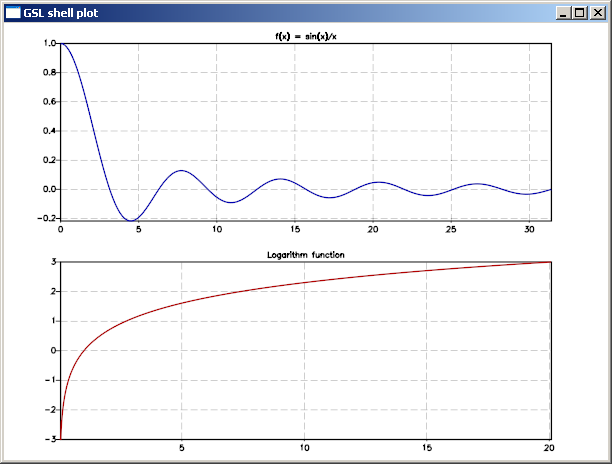
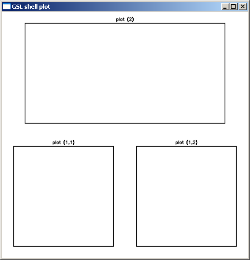
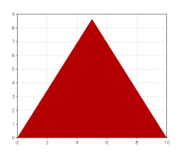
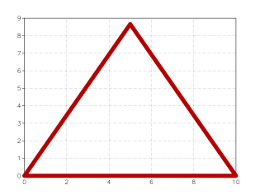
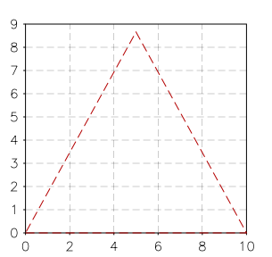

.. highlight:: lua

.. include:: <isogrk1.txt>

.. _graphics-chapter:

Graphics 
=========

Overview
--------

When you are working with a lot of numbers and complicated functions it is often useful to be able to do some plotting of the data.
GSL Shell offers a graphics module that allow to produce beatiful graphics with a very rich interface and almost illimited possibilities.

The graphics module in GSL Shell use for its implementation the excellent `Anti-Grain Geometry <http://www.antigrain.com/>`_ library, version 2.5, of Maxim Shemanarev.

GSL shell offer a graphics interface with few but powerful functions that, if appropriately used allows to the user to produce a wide range of plot types.

A First Example
---------------

.. module:: graph

Let's start with a simple example, let us suppose that we want to plot the function:

.. math::
   f(x) = \exp(-\alpha \, t) \, \sin(\omega \, t)

where |agr| and |ohgr| are constants and t vary from 0 to t1.

Before starting we need to note a couple of things.

The mathematical functions like exp, sin, cos are contained in the 'math' module.
You can use ``use 'math'`` to make them directely available.
The graphical functions are in the module 'graph'.
In order to access them you can use the :func:`use` function or just prefix all the functions with the module name like, for example, ``graph.plot``.
Choose whatever option you prefer, it is just a matter of taste.

So now we can came back to our mathematical functions.
We can plot this function with GSL Shell using the following instructions::

  use 'math'

  function myplot(alpha, omega, t1)
     -- create a new plot, it is not shown for the moment
     local p = graph.plot('f(x) = exp(-a t) sin(w t)')

     -- we create a line that corresponds to our function
     local ln = graph.fxline(|t| exp(-alpha*t)*sin(omega*t), 0, t1)

     -- we add the line to the plot and show it
     p:addline(ln, 'red')
     p:show()

     return p
  end

Then to plot something you have just to call the 'myplot' function. For example::

  myplot(0.3, 5, 6)

.. figure:: graphics-example-1.png

The function :func:`graph.fxline` takes three arguments, the function to plot and the initial anf final values of the variable. By default the function will be sampled with 256 points but if you want you can provide a fourth arguments to give the number of sample points.

In this example we have used the :func:`graph.plot` function to create a plot, the :func:`graph.fxline` function to create the line to draw and the method :func:`~Plot.addline` to add the line to the plot (in red). These three operations can be done with a single function, :func:`graph.fxplot`. It works like that::
  
   p = graph.fxplot(|x| sin(x), 0, 8*pi)

where the first arguments is the function to plot and the following
arguments are the extrema of variation of the indipendent variable x.

You may whish to add a title to the plot by using the :attr:`~Plot.title` attribute and may be save it in a file as an image by using the :meth:`~Plot.save` method. Here how to do it in two lines of code::

  p.title = "y = sin(x)"
  p:save('sin-function', 640, 480)

Graphics Functions
------------------

To create many type of plots you don't really need to use always the graphics primitives but you can use the higher level plotting functions.
We give in this section the description of all the higher level plotting functions.

.. function:: fxplot(f, xi, xs[, color, n])

   Produces a plot of the function ``f(x)`` for x going from ``xi`` to ``xs``.
   The last optional parameter ``n`` is the number of sampling point to use and, if not given, a default value will be used.
   The function returns the plot itself.

.. function:: fiplot(f, a, b[, color])
              fiplot(f, b)

   Produces a plot of the function ``f(i)`` where 'i' is an integer variable going from ``a`` to ``b``.
   In the second abbreviated form ``a`` take the default value of one.
   The function returns the plot itself.

   *Example*::
   
      -- plot the 'choose' function for some integer values
      graph.fiplot(|i| sf.choose(12, i), 12)

      -- plot of a geometric series
      graph.fiplot(|n| 0.9^n, 0, 36)

.. function:: fibars(f, a, b[, color, fill_ratio])

   Produces a bar plot of the function ``f(i)`` where ``i`` is an integer ranging from ``a`` to ``b``.
   The parameter ``fill_ratio`` determine the width of the bars and is by default equal to 1.
   When a smaller value is provided for ``fill_ratio`` the bars will be drawn with a smaller width along the x axis.

   *Example*::

      binom = function(n) return |i| sf.choose(n, i)/2^n end
      graph.fibars(binom(12), 0, 12, 'darkgreen', 0.8)

.. function:: fxline(f, xi, xs[, n])

   This function returns an graphical object of type :class:`Path` given by the points (x, f(x)) for x going from ``xi`` to ``xs`` with ``n`` sampling point.

   *Example*::

      use 'math'

      -- we create a 'path' for the function f(x) = sin(x)*exp(-0.1*x)
      -- and plot it

      p = graph.plot('Example')
      line = graph.fxline(|x| sin(x)*exp(-0.1*x), 0, 10*pi)
      p:addline(line)
      p:show()

   *Example*:
      You can produce very easily a nice illustration of the "area below a curve" with the following commands::

         use 'math'

         p = graph.plot('Example')
         line = graph.fxline(|x| sin(x)*exp(-0.1*x), 0, 10*pi)
         p:add(line, 'lightyellow')
         p:addline(line)
         p:show()

      and it will produce the following output:

      .. figure:: graphics-example-yellow-area.png

.. function:: filine(f, a, b)
              filine(f, b)

   This function returns an graphical object of type :class:`Path` given by the points (i, f(i)) where 'i' is an integer variable going from ``a`` to ``b``. It ``a`` is omitted values will be in the interval 1 .. b.

   For its usage see the similar function :func:`graph.fxline`.

.. function:: xyline(x, y)

   This function takes two column matrix of dimendions N as arguments and returns a graphical object of type :class:`Path` given by the points (x[i], y[i]) where i goes from 1 to N.

   *Example*::

      use 'math'

      N = 256
      sio2n = |w| sqrt(1.4923 + 0.61497*w^2/(w^2 - 0.115^2)-0.01059*w^2)
      -- define a matrix with wavelength and refrective index in each column
      d = matrix.new(N, 2, function(i,j)
                              local w = 0.4*(i-1)/(N-1)+0.4
                              return j == 1 and w or sio2n(w)
                           end)
      p = graph.plot('SiO2 dispersion curve in visible range')
      line = graph.xyline(d:col(1), d:col(2))
      p:addline(line)
      p:show()

.. function:: ipath(f)
              ipathp(f)

   This function takes an iterator function ``f`` and returns a :class:`Path` given by the points (x, y) returned by the iterator ``f``.
   The variant :func:`ipathp` is able to treat the case when the function ``f`` fails and it does continue by calling the iterator again.

   *Example*
      In the following example we shows how to create a circle by using an iterator to generates the points.
      We define first an iterator that use a counter to generate the points and then we pass the iterators to the function :func:`ipath`.
      In this way we obtain an object of type :class:`Path` and we can add into a plot.::

         use 'math'
	 -- create a simple iterator that return n points uniformly spaced
         -- in a circle centerd in (x0, y0) with radius R
	 circle = function(x0, y0, R, n)
                     local k = 0
                     return function()
                        if k <= n then
			   local th = 2*k*pi/n
                           local x, y = x0 + R*cos(th), y0 + R*sin(th)
                           k = k+1
                           return x, y
                        end
                     end
                  end
	 -- then we use ipath to create a path from the iterator
	 line = graph.ipath(circle(1, 1, 2.5, 256))
	 p = graph.plot('circle at (1,1) with R= 2.5')
	 p:add(line, graph.rgba(1,1,0,0.6))
	 p:addline(line)
	 p:show()
 
      The example above show how to create the more generic iterator just using basic Lua constructs.
      A generic iterator is very flexible because it can generate any sequence of values without restrictions of any kind.
      You will probably find that in many cases you want to build iterators that generate values over a range on integer numbers like we was doing for the circle in the example.
      In such cases it can be simpler to use the function :func:`iter.sequence` that creates an iterators over a range of integer.
      Here the same example of above but using the function :func:`iter.sequence`::

         use 'math'      
	 -- create a simple iterator that return n points uniformly spaced
         -- in a circle centerd in (x0, y0) with radius R
	 circle = function(x0, y0, R, n)
                     return function(k)
         	               local th = 2*k*pi/n
                               return x0 + R*cos(th), y0 + R*sin(th)
                            end
                  end
	 -- then we use ipath to create a path from the iterator
         n = 256
         cs = iter.sequence(circle(1, 1, 2.5, n), 0, n-1)
	 line = graph.ipath(cs)
	 p = graph.plot('circle at (1,1) with R= 2.5')
	 p:add(line, graph.rgba(1,1,0,0.6))
	 p:addline(line)
	 p:show()

.. function:: ibars(f)

   This function takes an iterator function ``f`` and returns a :class:`Path` object that draws many adjacent rectangular boxs correspondings to the points (x, y) returned by the iterator ``f``.
   This function simplify the creation of histograms.

   *Example*::

      use 'math'

      -- draws the histogram of a simulated gaussian distribution
      N = 800
      r = rng.new()
      f = |x| 1/sqrt(2*pi) * exp(-x^2/2)
      p = graph.plot('Simulated Gaussian Distribution')
      b = graph.ibars(sample(|x| rnd.poisson(r, f(x)*N) / N, -3, 3, 25))
      p:add(b, 'darkgreen')
      p:add(b, 'black', {{'stroke', width= 0.5}})
      p:addline(graph.fxline(f, -4, 4), 'red')
      p:show()

   We obtain the following plot:
 
   .. figure:: graphics-example-ibars.png

Multiple plot window
--------------------

With GSL shell it is possible to put several plots in a given window or also to put a given plot on several windows. To better understand what follows lets clarify a little bit the relations between plots and windows.

In GSL shell a plot can exists indipendetely of any window and viceversa, a window can exists without being associated to any plot. When you create a plot using the "plot" function the plot is not shown and is not associated to any window. When you call the method :meth:`~Plot.show` what happens is that:

 * a window is created and shown on the screen
 * the plot is *attached* to the window

You can perform the operations above explicitely if you want. For example::

   p = graph.plot('Test plot')
   w = graph.window()
   w:attach(p, '') -- attach the plot "p" to the default slot of "w"

In this code snippet you can see the method :meth:`~Window.attach` at work. It is a method of the :class:`Window` used to tie a particular plot to a window. At this point you may wonder what is the second argument for. It is something which is not very useful for simple windows but it becomes important when the window is "subdivided" into subwindows.

Let as see this at work with a second example::

   use 'math'

   -- create a window divided in two subwindows (vertical tiling)
   w = graph.window('v..')

   -- create a first plot...
   p1 = graph.plot('Logarithm function')
   p1:addline(graph.fxline(log, exp(-3), exp(3)))

   -- create a second plot
   p2 = graph.plot('f(x) = sin(x)/x')
   p2:addline(graph.fxline(|x| sin(x)/x, 0.0001, 10*pi), 'blue')
   
   w:attach(p1, '1') -- attach plot "p1" to the first available slot
   w:attach(p2, '2') -- attach plot "p2" to the second slot

And here what the results will looks like:

Window class
------------

.. class:: Window
   
   .. function:: window([layout])
      
      Create a new empty window with the layout given by the optional
      :ref:`layout string <layout-string>`. If the argument is omitted
      the window will have a single drawing area that will cover the whole
      window.

   .. method:: layout(spec)
      
      Remove all the plots that may be attached to the existing window
      and subdivide the window according to the given
      :ref:`layout string <layout-string>`.

   .. method:: attach(plot, slot)

      Attach the given ``plot`` to the window's slot speficied by the string ``slot``. The string should be a list of comma separated integer number in the form 'n1,n2,...,nk'. For each of the mentioned integer the corresponding window partition will be choosen recursively.

      Example::
 
        w = graph.window()

        -- create two vertical subdivision and divide the first area
        -- into two horizontal drawing regions
        w:layout('v(h..).')

        w:attach(p1, '1,1') -- attach plot "p1" to a the lower left subwindow
        w:attach(p1, '2')   -- attach plot "p2" to a the upper subwindow

.. _layout-string:

Layout string
~~~~~~~~~~~~~

The layout string is a string that is used to specify the layout of the drawing area in a window. This string is used by the :meth:`~Window.layout` method or, during the creation of the window, by the function :func:`window` itself.

A valid string layout is defined recursively and it is either:

* a '.' to indicate a region without further subdivisions
* the character 'h' followed by a sequence of layout strings
* the character 'v' followed by a sequence of layout strings
* the same as above but enclosed between brackets: '(' ')'.

With the serquence 'h' and 'v' you designate a subdivision along the horizontal or vertical direction respectively. Each subdivision is done in according to the sequence of cell layout that follows the 'h' or 'v'.

The pattern described above is recursive and you can use brackets to group items where needed to avoid ambiguity.

Example::
 
  w = window() -- create a window
  w:layout('v(h..).') -- split the windows in three drawing regions

and here how the resulting window can look:

we have added some empty plots so that you can see something inside the window.

Now let us see how to specify a particulat drawing area once the :meth:`~Window.layout` is done. Drawing are specification is done with the method :meth:`~Window.attach` with a string that identifies the drawing area. The string should be a list of comma separated integer number in the form 'n1,n2,...,nk'. With each number you identify the element of the current subdivision and the following numbers will select recursively the nested subdivisions. As the subdivision can be nested at arbitrary depth you should specify as many numbers as are the depth level of the drawing are you want to address.

For examples, to identify the drawing area in the sample above the following string should be used: '1,1', '1,2', '2'. You can attach a plot to a particular drawing area by using the method :meth:`~Window.attach` as follows::

   w:attach(p1, '1,2')

Graphics primitives
-------------------

In order to better understand the way GSL shell graphics works it is better to take a step back. Let use suppose that we want to plot an equilateral triangle. We can proceed as follows:
  - define a 'path' that describe the countour that we want to plot
  - add the 'path' that we have defined to a 'plot' object to show it

In order to create a 'path' we can use the function :func:`graph.path` which just creates an empty path. Then we add the the points by using the methods :meth:`~Path.move_to` and :meth:`~Path.line_to` methods. When you use :meth:`~Path.move_to` a new curve is started at the given points and with :meth:`~Path.line_to` you can draw your curve.

So to plot a triangle you can give the following instructions::

  t = graph.path()         -- a new path is created
  t:move_to(0, 0)    -- starting point
  t:line_to(10, 0)   -- second vertex
  t:line_to(5, 8.66) -- third vertex
  t:close()

  p = graph.plot()
  p:add(t, 'red')
  p:show()

Please not that we have used the :meth:`~Plot.add` method instead of :meth:`~Plot.addline` to add the path.

Now let us suppose that we want to plot only the contour of the triangle with a line 10 pixel thick and with round edges. Then what you have to do is to supply to the :meth:`~Plot.add` method a third argument where you specify a ``stroke`` transformation::

  p = graph.plot()
  p:add(t, 'red', {{'stroke', width=10, cap='round'}})
  p:show()

As you can see we have used the 'stroke' trasnformation and we have provided two parameters: 'width' and 'cap' to specify of the stroke should be done.

Now, to continue our example, let us suppose that we want to plot a dashed line just one pixel thick. In this case we have to cascade two transformations, the 'dash' transformation and the 'stroke' transformation. It can be done as follows::

  p = graph.plot()
  p:add(t, 'red', {{'stroke'}, {'dash', a= 10, b= 5}})
  p:show()

the 'a' and 'b' parameters specifies the lengths of the dash and of the blank space between the dashes. This length is calculated in pixel as it does depends on the size of the windows. Let us suppose now that you want to give the length of the dashes in the user coordinate system. In this case you have to provide it as a fourth arguments to the :meth:`~Plot.add`. So you should do something like that::

  p = graph.plot()
  p:add(t, 'red', {{'stroke'}}, {{'dash', a= 0.5, b= 0.25}})
  p:show()

You can note that we have changed the size of the dashes because in the user coordinate system the value 10 is big as the edge of the triangle.

So, if general, the :meth:`~Plot.add` methods takes two optional arguments, the list of the post-transforms and the list of the pre-transforms. The post-transforms are made when we are already in the window coordinate system while the pre-transforms are made in the user coordinate system.

Some transformations are naturally expressed as post-transforms because they does operates naturally in term of pixel while other are usually expressed as pre-transforms because they operates in the user coordinates space.

Plot
----

We have seen in the previous paragraph that you can add more graphical elements in a plot by using the methods :meth:`~Plot.add` and :meth:`~Plot.addline`. The method :meth:`~Plot.addline` is just a shortcut to add elements with a 'stroke' post transform of unitary width.

You can add elements to a plot in any moments even when it is already shown. GSL Shell will automatically calculate the bounding box so that every elements is shown on the window.

.. function:: plot([title])
   
   Create a new empty plot with an optional title. The plot is not
   attached to any window and is therefore not visible. To show the
   plot on the screen use either the :func:`show` plot's method or
   use the :meth:`~Window.attach` window's method to attach the plot to a
   specific window.

   This kind of plot automatically update its limits when the
   graphical objects that are added. The ``sync`` property is also
   initialized to a ``true`` value so that every operation triggers
   an update of all the windows that shows the plot. If you want to
   perform animations you may want to set the ``sync`` property to
   ``false`` and use the :meth:`~Plot.flush` method to update the windows
   when all the drawing operations have been done.

.. function:: canvas([title])
   
   Like the function above it does create a new empty plot with
   fixed logical limits. This latter kind of plot differs in that
   it will not update automatically its limits to fit the graphical
   objects. The method :func:`limits` should be used instead to set
   the logical limits of plotting area. The other difference with
   the :func:`graph.plot` function is that the property ``sync`` will be
   initialized to ``false``. This kind of plot is generally better
   suited for animations.

.. class:: Plot

   .. method:: add(obj, color[, post_trans, pre_trans])
      
      Add the :ref:`graphical object <graphics-objects>` ``obj`` to
      the plot with the given ``color``.  The optional arguments
      ``post_trans`` and ``pre_trans`` should be a table of
      :ref:`graphical transformations <graphics-transforms>`.

   .. method:: addline(obj, color[, post_trans, pre_trans])
      
      Add the :ref:`graphical object <graphics-objects>` ``obj`` to
      the plot by performing automatically a stroke of it. It is
      useful because you often need to draw lines and not filled
      polygons. It is equivalent to add a 'stroke' operations of
      unitary size in the viewport coordinates system.

   .. method:: limits(x1, y1, x2, y2)
      
      Set the logical limits of the area displayed by the plot to the
      rectangle with lower-left corner (x1, y1) and upper-right corner
      (x2, y2). This method is used for plots with fixed limits
      obtained with the function :func:`canvas`.

   .. method:: show()

      Create a new window to show the plot on the screen.

   .. method:: clear()

      Remove all the graphical elements into the current
      :ref:`graphical layer <graphical-layer>`.

   .. method:: flush()

      All the pending operations on a plot are processed and all the
      windows attached to the plot are updated. This method is only
      useful when the attribute ``sync`` is set to false.

   .. method:: pushlayer()

      Add a new :ref:`graphical layer <graphical-layer>` and into the
      plot so that it becames the current one and all the elements
      added with methods :meth:`~Plot.add` or :meth:`~Plot.addline`
      are associated with this new layer.

   .. method:: poplayer()

      Remove the current :ref:`graphical layer <graphical-layer>` and
      all its graphical elements and make the previous level the
      current one.

   .. method:: save(filename[, w, h])

      Save the plot in a file in a bitmap image format. The first
      argument is the file name without extension while the other
      optional arguments are the width and the height in pixel of the
      image. The format used is BMP on windows and PPM on Linux.

      all its graphical elements and make the previous level the
      current one.

   .. attribute:: units

      A boolean value that define if the axis and grids should be
      drawn or not. By default it is true.

   .. attribute:: title

      The title of the plot. You can change or set the title using
      this attribute.

   .. attribute:: sync

      This attribute can be either true or false. If true any changes
      in the plot will automatically update all the windows where the
      plot is shown. It is useful to set ``sync`` to false for
      animation so that many operations can be performed and the
      window is updated only when the :meth:`~Plot.flush` method is called.

.. _graphical-layer:

Graphical Layers
~~~~~~~~~~~~~~~~

When you want to perform animations with plot you can take advantage of the :ref:`graphical layers <graphical-layer>` that allows to clear and redraw only some graphical elements while keeping other elements always present in the background. The idea is that if you want to make an animation you will probably clear and redraw over and over some graphical elements but you may want to keep some of them fixed in the background. In order to obtain that you can

  * add normally all the fixed graphical elements
  * add a new :ref:`graphical layer <graphical-layer>` with the method :meth:`~Plot.pushlayer`
  * clear and redraw all the elements using the new topmost layer

Here an simple example::

  p = graph.canvas('Animation Test')
  p:limits(-100, -100, 100, 100)
  p:show()

  p:add(graph.circle(0, 0, 80), 'blue', {{'stroke', width= 5}})

  x, y = 0, 0
  vx, vy = 2, 5
  R = 20 

  p:pushlayer()
  for k=1, 100 do
    if x + vx + R > 100 or x + vx - R < -100 then vx = -vx end
    if y + vy + R > 100 or y + vy - R < -100 then vy = -vy end
    x = x + vx
    y = y + vy

    p:clear()
    p:add(graph.circle(x, y, R), 'red')
    p:flush()
  end

.. _graphics-objects:

Graphical Objects
-----------------

.. function:: path([x, y])
 
   Creates an empty path. If the two coordinates (x, y) are provided set the initial point of the path to (x, y).

.. class:: Path

   .. method:: move_to(x, y)

      Move the current point to the coordinates (x, y) and start here a new path.
   .. method:: line_to(x, y)

      Add a line into the path from the previous point to the specified (x, y) coordnates.

   .. method:: close()

      Close the polygon.

   .. method:: arc_to(x, y, angle, large_arc, sweep, rad_x, rad_y)

      Add as arc or ellipse with radius rx and ry up to the point (x, y).

   .. method:: curve3(x_ctrl, y_ctrl, x, y)

      Add a conic bezier curve up to (x, y) with a single control point. The curve will be dislayed as such only if a 'curve' :ref:`graphical transformation <graphics-transforms>` is used in the transformations pipeline.

   .. method:: curve4(x1_ctrl, y1_ctrl, x2_ctrl, y2_ctrl, x, y)

      Add a conic bezier curve up to (x, y) with two control points. The same remarks for the method :func:`curve3` applies to :func:`curve4`.

.. function:: text([height, width])

   Create a text of the given height.
   The second optional parameter ``width`` defines the width of the font.

.. class:: Text

   A text object is used to display a text.
   This class of graphical object is special because it is not a shape that is resized rigidly with the window, the text is always displayed with the same size in pixel.
   Becasue of this difference a text object should be subject only to post-transforms.

   .. attribute:: text

      Set the text shown.

   .. attribute:: angle
 
      Rotate the text of the given angle (in radians).

   .. method:: justif(hv)

      Set the justification of the text.
      The argument ``hv`` should be a string of the form 'xy' where x is a letter among 'l', 'c' or 'r' that determine the horizontal justification and y is a letter among 't', 'c' or 'b' for the vertical justification.

   .. method:: set(x, y)
 
      Set the position where the test is diplayed. It corresponds to
      the bottom left corner of the text.

.. _graphics-transforms:

Graphical transformations
-------------------------

A generical graphical transformation is expressed in the form of table with the following layout::

  {'name',
   property1 = value1,
   property2 = value2,
   ...
  }

For example, to express a 'stroke' transform you can write::

  {'stroke', width= 5}

to mean a stroke transformation with a stroke width of 5.

Here a complete list of all the available transforms:

  **stroke**
     A stroke create an outline of the given path. The properties are:

     * **width**, the width of the stroke, default value is width=1
     * **cap**, can be 'round', 'butt' or 'square'. The default value is 'butt'.
     * **join**, can be 'miter', 'miter.rev', 'miter.round', 'round' and 'bevel'

  **dash**
    Transform the path to a sequence of dashes. The following elements in the table are the length of the dashs and gaps.

    For example, to express a dash-dot  line you can write ``{'dash', 7,3,3,3}``.

  **curve**
    This transformation make the 'curve3' and 'curve4' path elements became real curves.

  **marker**
    Replace each vertex of the path with a circular mark
   
    * **size**, the size of the marker
    * **mark**, the kind of marker, can be 'circle', 'triangle' or 'square'

  **translate**
    A translation along the x and y axis. This transformation can be used only in the user coordinate system.

    * **x**, translation along the x axis
    * **y**, translation along the y axis

  **scale**
    A scaling of the image around the point (0, 0). Only one numeric
    parameter should be supplied to indicate the scaling factor. For
    example ``{'scale', 2}`` will scale the image of a factor two.

  **extend**
    Shrink or expand a shape of a given amount.

    * **width**, the size of the shrink/expansion.
      If positive is an expansion otherwise is a shrink.

  **rotate**
    A rotation of a given angle with respect of the origin. This transformation can be used only in the user coordinate system.

    * **angle**, the angle of the rotation, in radians.
