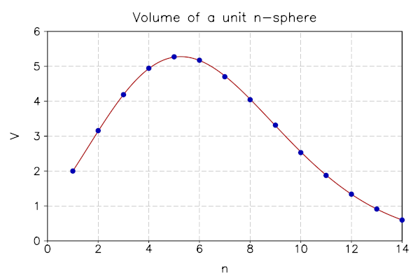

.. highlight:: lua

.. _introduction:

GSL Shell introduction
======================

GSL Shell is an interactive interface that gives access to the GSL numerical routines by using Lua, an easy to learn and powerful programming language.
With GSL Shell you can access very easily the functions provided by the GSL library without the need of writing and compile a stand-alone C application.
In addition the power and expressiveness of the Lua language make easy to develop and tests complex procedures to treat your data and use effectively the GSL routines.
You will be also able to create plots in real-time by using the powerful built-in graphical module.

.. note::
  GSL Shell is still a young project and it is currently not widely used.
  It still lacks some important features but the author believe that it is very promising because it is built on top of three outstanding free software projects: the GSL library, LuaJIT2 and the AGG library.

  By using and combining together these software components GSL Shell provides the possibility of doing advanced numerical calculations and produce beautiful plot of the data or mathematical functions.

  The underlying programming language, Lua, itself a very cleverly designed programming language it is therefore an excellent platform for programming.
  In addition the LuaJIT2 implementation provides excellent execution speed that can be very close to C compiled code.

GSL Shell also introduces some extensions to the Lua language that will be explained in the following sections. Those features include :ref:`complex numbers<complex_numbers>`, easy-to-use :ref:`vector/matrix<matrices>` implementations, :ref:`short function syntax<short-func-notation>` and :ref:`iterators<lua_base>`. They are designed to facilitate the work with numbers and mathematical algorithms.

First steps
-----------

The most basic usage of GSL Shell is just like a calculator: you can type any expression and GSL Shell will print the results.
GSL Shell is designed to work mainly with floating point numbers stored internally in double precision.
Sometimes we will refer to these kind of number as *real* number in opposition to *complex* number.

For integer numbers GSL Shell differs from many other programming environment because it does not have a distinct type to represent them.
In other words integer numbers are treated just like *real* number with all the implications that follows.

.. _complex_numbers:

Complex numbers
~~~~~~~~~~~~~~~

When you need to define a complex number you can use a native syntax like in the following example::

   x = 3 + 4i

The rule is that when you write a number followed by an 'i' it will be considered as a pure imaginary number.
The imaginary number will be accepted only if the 'i' follows immediately the number without any interleaving spaces.
Note also that if you write 'i' alone this will be not interpreted as the imaginary unit but as the variable 'i'.
The imaginary unit can be declared by writing '1i' because the '1' at the beginning force the interpreter to consider it like a number.

All the functions in the :mod:`math` like exp, sin, cos etc. works on *real* numbers.
If you want to have operations that operates on complex numbers you should use the functions defined in the :mod:`complex` module.

The other important mathematical types in GSL Shell are matrices, either of complex or real numbers.
In addition Lua offers a native type called "table".
This latter is very useful for general purpose programming because  because it can store any kind of data or structures but you should be careful to not confuse Lua tables with matrices.
You can work with both types as far as you understand the difference and use the appropriate functions to operate on them.

Most of the GSL functions operate on real or complex matrix because of the nature of the GSL library itself.

A couple of useful tricks
~~~~~~~~~~~~~~~~~~~~~~~~~

When you are working in a interactive session GSL Shell will always remember the last result evaluated.
You can access its value using the global variable "_".
When the you evaluate a statement or an expression that returns no values the variable "_" is not modified.

Another useful thing to know is that you can suppress the returned value by adding a ';' character at the end of line.
This can be useful to avoid to show a large table or matrix if you don't want to see them on the screen.

.. _matrices:

Working with matrices
~~~~~~~~~~~~~~~~~~~~~

In order to define a matrix you have basically two options, you can enumerate all the values or you can provide a function that generate the terms of the matrix.
In the first case you should use the :func:`matrix.def` like in the following example::

   use 'math'

   th = pi/8 -- define the angle "th"

   -- define 2x2 rotation matrix for the given angle "th"
   m = matrix.def {{cos(th), sin(th)}, {-sin(th), cos(th)}}

You can remark that we have used the :func:`matrix.def` function without parentheses to enclose its arguments.
The reason is that, when a function is called with a single argument which is a literal table or string, you can omit the enclosing parentheses.
In this case we have therefore omitted the parenthesize because :func:`matrix.def` has a single argument that is a literal table.

Note that in our snippet of code we have used the function :func:`use` to make the function available in the module :mod:`math` available.
If you don't use :func:`use` the function :func:`math.sin` and :func:`math.cos` should be accessed by specifying the explicitly the ``math`` namespace.

You can define also a column matrix using the function :func:`matrix.vec` like follows::

   v = matrix.vec {cos(th), sin(th)}

The other way to define a matrix is by using the :func:`matrix.new` function (or :func:`matrix.cnew` to create a complex matrix).
This latter function takes the number of rows and columns as the first two arguments and a function as an optional third argument.
Let as see an example to illustrate how it works::

   -- define a matrix whose (i, j) elements is 1/(i + j)
   m = matrix.new(4, 4, |i,j| 1/(i + j))

In this example the third argument is a function expressed with the :ref:`short function notation <short-func-notation>`.
This function takes two arguments, respectively the row and column number, and returns the value that should be assigned to the corresponding matrix element.
Of course you are not forced to define the function in the same line, you can define it before and use it later with the :func:`matrix.new` function like in the following example::

   -- define the binomial function
   function binomial(n, k)
     if k <= n then
         return sf.choose(n-1, k-1)
     else
         return 0
     end
   end

   -- define a matrix based on the function just defined
   m = matrix.new(8, 8, binomial)

and here the result:

    >>> m
    [  1  0  0  0  0  0  0  0 ]
    [  1  1  0  0  0  0  0  0 ]
    [  1  2  1  0  0  0  0  0 ]
    [  1  3  3  1  0  0  0  0 ]
    [  1  4  6  4  1  0  0  0 ]
    [  1  5 10 10  5  1  0  0 ]
    [  1  6 15 20 15  6  1  0 ]
    [  1  7 21 35 35 21  7  1 ]

An alternative compact writing could have been::

    m = matrix.new(8, 8, |n,k| k <= n and sf.choose(n-1, k-1) or 0)

where we have used again the short function notation and the Lua logical operators ``and`` and ``or``.

Matrix operations
~~~~~~~~~~~~~~~~~

If we want to obtain the inverse of the matrix defined above we can use the function :func:`matrix.inv`.
Let us see how it works by using the matrix ``m`` defined above and taking its inverse::

  use 'math'

  -- we define the matrix
  m = matrix.new(8, 8, |n,k| k <= n and sf.choose(n-1, k-1) or 0)

  -- we obtain the inverse
  minv = matrix.inv(m)

Then the matrix ``minv`` will be equal to::

   >>> minv
   [   1   0   0   0   0   0   0   0 ]
   [  -1   1   0   0   0   0   0   0 ]
   [   1  -2   1   0   0   0   0   0 ]
   [  -1   3  -3   1   0   0   0   0 ]
   [   1  -4   6  -4   1   0   0   0 ]
   [  -1   5 -10  10  -5   1   0   0 ]
   [   1  -6  15 -20  15  -6   1   0 ]
   [  -1   7 -21  35 -35  21  -7   1 ]

If we want to check that ``minv`` is actually the inverse of ``m`` we can perform the matrix multiplication to check::

   >>> minv * m
   [ 1 0 0 0 0 0 0 0 ]
   [ 0 1 0 0 0 0 0 0 ]
   [ 0 0 1 0 0 0 0 0 ]
   [ 0 0 0 1 0 0 0 0 ]
   [ 0 0 0 0 1 0 0 0 ]
   [ 0 0 0 0 0 1 0 0 ]
   [ 0 0 0 0 0 0 1 0 ]
   [ 0 0 0 0 0 0 0 1 ]

and as we should expect we have actually obtained the unit matrix.

The matrix inverse can be used to solve a linear system so let us try.
First we define a column vector, fox example::

   b = matrix.new(8, 1, |i| sin(2*pi*(i-1)/8))
   >>> b
   [           0 ]
   [  0.70710678 ]
   [           1 ]
   [  0.70710678 ]
   [           0 ]
   [ -0.70710678 ]
   [          -1 ]
   [ -0.70710678 ]

The we can solve the linear system ``m * x = b`` using the inverse matrix ``minv`` as follows::

   x = minv * b
   >>> x
   [           0 ]
   [  0.70710678 ]
   [ -0.41421356 ]
   [ -0.17157288 ]
   [  0.34314575 ]
   [ -0.10050506 ]
   [ -0.14213562 ]
   [  0.14213562 ]

so that the resulting column matrix x will satisfy the equation ``m * x = b``.

The reader familiar with linear algebra computations may argue that using matrix inversion to solve a linear system is inefficient.
This is actually true and GSL Shell offers the function :func:`matrix.solve` to solve a linear system efficiently.
So in the example above we could have used the function :func:`matrix.solve` as follows::

   x = matrix.solve(m, b)

to obtain the same result of above.

Working with complex matrices
~~~~~~~~~~~~~~~~~~~~~~~~~~~~~

In the example above we have shown how to solve a linear system in the form ``m * x = b``.
We may wonder how to manage the case when ``m`` or ``b`` are complex.
The answer is easy, since GSL Shell always check the type of the matrix and the appropriate algorithm is selected.

So, to continue the example above, we can define b as a complex vector as follows::

   b = matrix.cnew(8, 1, |i| complex.exp(2i*pi*(i-1)/8))
   >>> b
   [                       1 ]
   [  0.70710678+0.70710678i ]
   [                       i ]
   [ -0.70710678+0.70710678i ]
   [                      -1 ]
   [ -0.70710678-0.70710678i ]
   [                      -i ]
   [  0.70710678-0.70710678i ]

and then we can use the function :func:`matrix.solve` as above and we will obtain a complex matrix that solve the linear system.

Please note that above we have used the function :func:`matrix.cnew` to create a new complex matrix.
The reason is that we need to inform GSL Shell in advance if we want a real or a complex matrix.

In general GSL Shell tries to ensure that all the common matrix operations are handle to transparently handle real or complex matrices.

Matrix indexing
~~~~~~~~~~~~~~~

You can index the matrix but only one index is permitted so the syntax ``m[2]`` is OK but ``m[2,3]`` will not be accepted.
This is limitation of GSL Shell that is related to the Lua programming language on which it is based.

So when you write ``m[2]`` you will obtain the second row of the matrix ``m`` but in *column* form.
So, if we use the matrix ``m`` defined above we could have:

  >>> m[5]
  [ 1 ]
  [ 4 ]
  [ 6 ]
  [ 4 ]
  [ 1 ]
  [ 0 ]
  [ 0 ]
  [ 0 ]

It may seems odd the the row is returned in column form but it is actually convenient because many function accept a column matrix in input.
The idea is that in GSL Shell column matrices play the role of vectors.

Following the same logic of above, if you index a column matrix you will just obtain its n-th element, to return a 1x1 matrix will be not very useful.
So you can have for example:

  >>> m[5][4]
  4

At this point it should be clear that, in general, you can access the elements of a matrix with the double indexing syntax ``m[i][j]``.

Something that is important to know about the matrix indexing to obtain a row is that the column matrix refer to the same underlying data of the original matrix.
As a consequence any change to the elements of the derived matrix will be effective also for the original matrix.

The indexing method that we have explained above can be used not only for retrieving the matrix elements or an entire row but it can be equally used for assignment.
This means that you can use double indexing to change an element of a matrix.
If you use a simple indexing you can assign the content of a whole row all at once.

Just a small note about efficiency.
The double indexing method can be slow and should be probably avoided in the tight loop where the performance is important.
In this case you should use the methods :meth:`~Matrix.get` and :meth:`~Matrix.set`.
Another opportunity is to address directly matrix data by using its ``data`` field but this requires a particular attention since this kind of operations are not safe and you could easily crash the application.

You can find more details in the chapter about :ref:`GSL FFI interface <gsl-ffi-interface>`.

.. _plotting:

Plotting functions
~~~~~~~~~~~~~~~~~~

The plotting functions lives in the ``graph`` module. The more common and useful functions are probably :func:`graph.fxplot` and :func:`graph.fxline`.
The first one can used to create a plot while the second one just create a graphical object of type line.
A graphical object is visible only when it is added into a plot.
The idea is that you can create the objects as needed and add them of the plot as it is more appropriate.

Here a simple example to plot some simple functions::

   use 'math'

   -- we create a plot of a simple function
   p = graph.fxplot(|x| exp(-0.1*x) * sin(x), 0, 8*pi)

   -- we create a graphical object that describe second function
   -- and we add it to the previous plot
   ln = graph.fxline(|x| exp(-0.1*x) * cos(x), 0, 8*pi)
   p:addline(ln, 'blue')

   p.title = 'Damped sine and cosine'

Let us explain the example step by step.
To use the function :func:`graph.fxplot` we pass three arguments: the function that we want to plot and the minimum and maximum value of the abscissa.
The function will therefore produce a plot of the function y=f(x) for x that span the given interval.
There is actually some magic that we have used to define the function on the fly.
We have used the :ref:`short function syntax <short-func-notation>` that let us define a function using the syntax ``|x| f(x)`` or in the case of multiple variable ``|x,y| f(x,y)``.
The short function syntax is very convenient to express simple function with a compact syntax.

The second function :func:`graph.fxline` operates in a similar way but it does create a graphical object instead of a plot.
Then in the following instruction we add the second line in the plot by using the :meth:`~Plot.addline` method.

We can also set the title of the plot by using the :attr:`~Plot.title` property of the plot.

Here the plot that we obtain with the snippet given above:

.. figure:: plot-intro-example.png

You can refer to the :ref:`Graphics chapter <graphics-chapter>` for more details about the plotting functions.

.. _short-func-notation:

Short Function Notation
~~~~~~~~~~~~~~~~~~~~~~~

In numerical environments, one often needs simple functions that just return a value. In this case GSL Shell introduces a special notation::

   |a, b, ...| expr

where ``expr`` is any expression is equivalent to::

   function(a, b, ...) return expr end

So, for example, to write the function that return a square of a number plus one you could write::

   f = |x| x^2+1

this is exactly equivalent to the following syntax::

   function f(x)
      return x^2+1
   end

or, alternatively::

   f = function(x) return x^2+1 end

An Example
------------

To illustrate most of the key features of GSL Shell, let us write a short script to calculate the volume of an n-dimensional unit sphere and compare it with the analytical solution of :math:`V_n=\pi^{n/2}/ \Gamma(1+n/2)`.

For the integration in high dimensions, we will the :ref:`Monte Carlo VEGAS <monte-vegas>` implementation, that is included in GSL Shell.

At the beginning of each script, you should think about which sections of GSL Shell you want to use.
If you utilize functions from certain modules more often, you might want to call those functions directly with the help of the :func:`use` directive::

   use 'iter'
   use 'math'

If you don't use the :func:`use` directive you can still access the functions from a module but you need to specify the full name.
So, for example, you can refer to the VEGAS algorithm using its full name ``num.monte_vegas``.
This latter approach is useful because avoids conflicts in the global namespace.

Now we need to define the integrand function.
Since we want to calculate the volume of a `n`-dimensional sphere the function should accept a `n`-tuple of coordinates and return 1 if the sampling point is inside the unit sphere or 0 otherwise.
To work correctly the VEGAS algorithm assume that the integrand function takes a single arguments that is a table with the `n` coordinates.
Since the computation depends on the dimension `n` of the space we need to take this later intro account.
The solution is to define a function that we can call `getunitsphere` that returns the integrand function for the `n`-dimension space.

The `n`-dimensional integrand function itself calculates the summed square of the table values for a given size which equals :math:`R^2=\sum_{i=1}^nx_i^2`.
So `getunitsphere` can be defined as follows::

   local function getunitsphere(n)
      return function(x)
         local s = 0
         for k= 1, n do s = s + x[k]^2 end
         return s < 1 and 1 or 0
      end
   end

This is the function we will use to integrate later.

Now we can prepare a graph path that will hold all calculated values (:func:`graph.path`).
Also ::

   local ln = graph.path(1, 2) -- 1-sphere = [-1, 1] (length 2)

Now we can start to calculate the volume of the unit sphere of the first 14 dimensions::

   for d=2, 14 do

      local a, b = ilist(|| 0, d), ilist(|| 1, d)
      local calls, n = d*1e4,1

      --Obtaining monte carlo vegas callback
      local res,sig,num,cont = monte_vegas(getunitsphere(d),a,b,calls)

      --Increasing the number of calls to reach a satisfying result
      while(sig/res > 0.005) do
         res,sig,num = cont(calls*(2^n))
         n=n+1
      end

      ln:line_to(d,res*2^d)
   end

The loop consists of three major parts.
In the first part we initialize the important variables with the help of the `short function syntax` and the :func:`iter.ilist` function, which conveniently creates vectors of any size with a value provided by the function.
In this case `a` and `b` are the lower and the upper boundary for the integration.

By calling :func:`num.monte_vegas` with the desired unitsphere function, the monte carlo vegas algorithm is being invoked for the first time.
It returns multiple arguments, namely the result itself, the precision, the number of iterations it took and a continuation function that can be called to recalculate the result with higher precision.

Depending on the relative precision `sig/res`, we continue to recalculate the integral with increasing numbers of iterations.
When it is done, we add the dimension and the result to our given path by :func:`~Path.line_to`.

We can now continue to compare the data with analytical solutions and plot these results.
First we need to initialize a :func:`graph.plot` object.
Then we can add the data to the plot with :func:`~Plot.add` and the result of the analytical solution with :meth:`~Plot.addline`.
Notice that you can change the appearance of the data points at this moment.
We are going for markers with size 8.
At that point, we are using `short functions` again which greatly facilitates the syntax in this case::

   local p = graph.plot('Volume of a unit n-sphere')
   p.clip, p.pad = false, true
   p:addline(graph.fxline(|n| pi^(n/2) / sf.gamma(1+n/2), 1, max_dim))
   p:add(ln, "blue", {{'marker', size=8}})
   p.xtitle="n"
   p.ytitle="V"
   p:show()

Also we are using :func:`sf.gamma` from the special functions section which offers all such functions that you can find in the GSL library.
After setting the axis-names with :func:`~Plot.xtitle` and :func:`~Plot.ytitle`, we are ready to show the plot with :func:`~Plot.show`:

Here is the code in a whole:

.. literalinclude:: intro-example.lua
   :language: lua

This rather simple example showed quite a lot of important features of GSL Shell.
Creating data structures with `iterators` and `short functions` are both very common.

With the function `getunitsphere` we have shown that some problems can be solved in an elegant way by returning a function.
These kind of functions are called closures because they refer to local variables declared outside of the function body itself.
In this particular case the function returned by `getunitsphere` is a closure because it does refer to the variable `n` defined outside of its body.
The function `cont` returned my `num.monte_vegas` is also another example of closure since it does refer to the current state of the VEGAS integration.

