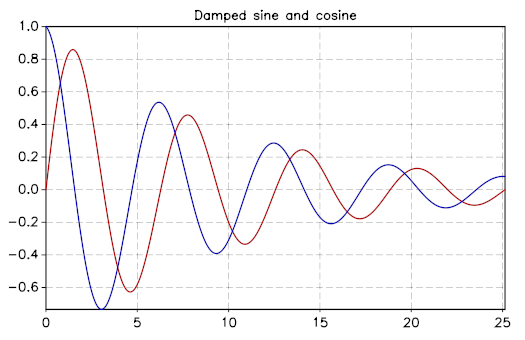

.. highlight:: lua

.. _introduction:

GSL Shell introduction
======================

GSL Shell is an interactive interface that gives access to the GSL numerical routines by using Lua, an easy to learn and powerful programming language.
With GSL Shell you can access very easily the functions provided by the GSL library without the need of writing and compile a stand-alone C application.
In addition the power and expressivity of the Lua language make easy to develop and tests complex procedures to treat your data and use effectively the GSL routines.
You will be also able to create plot in real-time by using the powerful builtin graphical module.

.. note::
  GSL Shell is still a young project and it is currently not widely used.
  It still lacks some important features but the author believe that it is very promising because it is built on top of three outstanding free software projects: the GSL library, LuaJIT2 and the AGG library.

  By using and combining together these software components GSL Shell provides the possibility of doing advanced numerical calculations and produce beautiful plot of the data or mathematical functions.

  The underlying programming language, Lua, itself a very cleverly designed programming language it is therefore an excellent platform for programming.
  In addition the LuaJIT2 implementation provides excellent execution speed that can be very close to C compiled code.
  

First steps
-----------

The most basic usage of GSL Shell is just like a calculator: you can type any expression and GSL Shell will print the results.
GSL Shell is designed to work mainly with floating point numbers stored internally in double precision.
Sometimes we will refer to these kind of number as *real* number in opposition to *complex* number.

For integer numbers GSL Shell differs from many other programming environment because it does not have a distinct type to represent them.
In other words integer numbers are treated just like *real* number with all the implications that follows.

When you need to define a complex number you can use a native syntax like in the following example::

   x = 3 + 4i

The rule is that when you write a number followed by an 'i' it will be considered as a pure imaginary number.
The imaginary number will be accepted only if the 'i' follows immediately the number without any interleving spaces.
Note also that if you write 'i' alone this will be not interpreted as the imaginary unit but as the variable 'i'.
The imaginary unit can be declared by writing '1i' because the '1' at the beginning force the intepreter to consider it like a number.

All the functions in the :mod:`math` like exp, sin, cos etc. works on *real* numbers.
If you want to have operations that operates on complex numbers you should use the functions defined in the :mod:`complex` module.

The other important mathematical types in GSL Shell are matrices, either of complex or real numbers.
In addition Lua offers a native type called "table".
This latter is very useful for general purpose programming because  because it can store any kind of data or structures but you should be careful to not confuse Lua tables with matrices.
You can work with both types as far as you understand the difference and use the appropriate functions to operate on them.

Most of the GSL functions operate on real or complex matrix because of the nature of the GSL library itself.

An useful trick
~~~~~~~~~~~~~~~

When you are working in a interactive session GSL Shell will always remember the last result evaluated.
You can access its value using the global variable "_".
When the you evaluate a statement or an expression that returns no values the variable "_" is not modified.

Working with matrices
~~~~~~~~~~~~~~~~~~~~~

In order to define a matrix you have basically two options, you can enumerate all the values or you can provide a function that generate the terms of the matrix.
In the first case you should use the :func:`matrix.def` like in the following example::

  use 'math'

  th = pi/8 -- define the angle "th"

  -- define 2x2 rotation matrix for the given angle "th"
  m = matrix.def {{cos(th), sin(th)}, {-sin(th), cos(th)}}

You can remark that we have used the :func:`matrix.def` function without parentheses to enclose its arguments.
The reason is that, when a function is called with a single argument which is a literal table or string, you can omit the enclosing paretheses.
In this case we have therefore omitted the parantheses because :func:`matrix.def` has a single argument that is a literal table.

Note that in our snippet of code we have used the function :func:`use` to make the function available in the module :mod:`math` available.
If you don't use :func:`use` the function :func:`math.sin` and :func:`math.cos` should be accessed by specifying the explicitely the ``math`` namespace.

You can define also a column matrix using the function :func:`matrix.vec` like follows::

  v = matrix.vec {cos(th), sin(th)}

The other way to define a matrix is by using the :func:`matrix.new` function (or :func:`matrix.cnew` to create a complex matrix).
This latter function takes the number of rows and columns as the first two arguments and a function as an optional third argument.
Let as see an example to illustrate how it works::

  -- define a matrix whose (i, j) elements is 1/(i + j)
  m = matrix.new(4, 4, |i,j| 1/(i + j))

In this example the third argument is a function expressed with the :ref:`short function notation <short-func-notation>`.
This function takes two arguments, respectively the row and column number, and returns the value that should be assigned to the corrisponding matrix element.
Of course you are not forced to define the function in the same line, you can define it before and use it later with the :func:`matrix.new` function like in the following example::

  -- define the binomial function
  function binomial(n, k)
    if k <= n then
      return sf.choose(n-1, k-1)
    else
      return 0
    end
  end

  -- define a matrix based on the function just defined
  m = matrix.new(8, 8, binomial)

and here the result:

  >>> m
  [  1  0  0  0  0  0  0  0 ]
  [  1  1  0  0  0  0  0  0 ]
  [  1  2  1  0  0  0  0  0 ]
  [  1  3  3  1  0  0  0  0 ]
  [  1  4  6  4  1  0  0  0 ]
  [  1  5 10 10  5  1  0  0 ]
  [  1  6 15 20 15  6  1  0 ]
  [  1  7 21 35 35 21  7  1 ]

An alternative compact writing could have been::

  m = matrix.new(8, 8, |n,k| k <= n and sf.choose(n-1, k-1) or 0)

where we have used again the short function notation and the Lua logical operators ``and`` and ``or``.

Matrix indexing
~~~~~~~~~~~~~~~

You can index the matrix but only one index is permitted so the syntax ``m[2]`` is ok but ``m[2,3]`` will not be accepted.
This is limitation of GSL Shell that is related to the Lua programming language on which it is based.

So when you write ``m[2]`` you will obtain the second row ofthe matrix ``m`` but in *column* form.
So, if we use the matrix ``m`` defined above we could have:

  >>> m[5]
  [ 1 ]
  [ 4 ]
  [ 6 ]
  [ 4 ]
  [ 1 ]
  [ 0 ]
  [ 0 ]
  [ 0 ]

It may seems odd the the row is returned in column form but it is actually convenient because many function accept a column matrix in input.
The idea is that in GSL Shell column matrices play the role of vectors.

Following the same logic of above, if you index a column matrix you will just obtain its n-th element, to return a 1x1 matrix will be not very useful.
So you can have for example:

  >>> m[5][4]
  4

At this point it should be clear that, in general, you can access the elements of a matrix with the double indexing syntax ``m[i][j]``.

Something that is important to know about the matrix indexing to obtain a row is that the column matrix refer to the same underlying data of the original matrix.
As a consequence any change to the elements of the derived matrix will be effective also for the original matrix.

The indexing method that we have explained above can be used not only for retrieving the matrix elements or an entire row but it can be equally used for assignment.
This means that you can use double indexing to change an element of a matrix.
If you use a simple indexing you can assign the content of a whole row all at once.

Just a small note about efficiency.
The double indexing method can be slow and should be probably avoided in the tight loop where the performance is important.
In this case you should use the methods :meth:`~Matrix.get` and :meth:`~Matrix.set`.
Another opportunity is to adress directly matrix data by using its ``data`` field but this requires a particular attention since this kind of operations are not safe and you could easily crash the application.

You can find more details in the chapter about :ref:`GSL FFI interface <gsl-ffi-interface>`.

Plotting functions
~~~~~~~~~~~~~~~~~~

The plotting functions lives in the ``graph`` module. The more common and useful functions are probably :func:`graph.fxplot` and :func:`graph.fxline`.
The first one can used to create a plot while the second one just create a graphical object of type line.
A graphical object is visible only when it is added into a plot.
The idea is that you can create the objects as needed and add them of the plot as it is more appropriate.

Here a simple example to plot some simple functions::

  use 'math'

  -- we create a plot of a simple function
  p = graph.fxplot(|x| exp(-0.1*x) * sin(x), 0, 8*pi)

  -- we create a graphical object that describe second function
  -- and we add it to the previous plot
  ln = graph.fxline(|x| exp(-0.1*x) * cos(x), 0, 8*pi)
  p:addline(ln, 'blue')

  p.title = 'Damped sine and cosine'

Let us explain the example step by step.
To use the function :func:`graph.fxplot` we pass three arguments: the function that we want to plot and the minimum and maximum value of the abscissa.
The function will therefore produce a plot of the function y=f(x) for x that span the given interval.
There is actually some magic that we have used to define the function on the fly.
We have used the :ref:`short function syntax <short-func-notation>` that let us define a function using the syntax ``|x| f(x)`` or in the case of multiple variable ``|x,y| f(x,y)``.
The short function syntax is very convenient to express simple function with a compact syntax.

The second function :func:`graph.fxline` operates in a similar way but it does create a graphical object instead of a plot.
Then in the following instruction we add the second line in the plot by using the :meth:`~Plot.addline` method.

We can also set the title of the plot by using the :attr:`~Plot.title` property of the plot.

Here the plot that we obtain with the snippet given above:

You can refer to the :ref:`Graphics chapter <graphics-chapter>` for more details about the plotting functions.

Functions
---------

GSL Shell is very flexible about function definitions.
It does allow to define global functions or to create on the fly a function and to assign it to a variable.
Actually in GSL Shell functions are first class object and they can be treated like any other objects.

Here an examples where we define the normalized gaussian function centered in zero::

    function gauss(x, s)
       local n = 1/sqrt(2*pi*s^2)
       return n * exp(-x^2/2)
    end

Please note that we have used a "local" variable, ``n`` that is visible only withing the scope of the function.
This is very convenient because in this way the variable ``n`` will not interfere with the global variables.

GSL Shell also support *closures* like many other advanced programming languages like Lisp, Scheme or ML languages.
A closure is a function that refers to some local variables that lives in the scope of the calling function.

Here an examples of a closure the define a "counter"::

   function make_counter(n)
      local i = 0
      return function()
                if i < n then
                   i = i + 1
                   return i
                end
   end

and here an examples of its utilisation:

  >>> -- make a counter up to 3
  >>> c = make_counter(3)
  >>> c()
  1
  >>> c()
  2
  >>> c()
  3
  >>> c()
  nil

The function ``make_counter`` is not a closure because does not refer to any variable of any enclosing function but the function that it does returns *is* a closure because the returned function refer to the variable ``i`` which is local to the scope of the enclosing function ``make_counter``.

This kind of function is ofter called an "iterator".
In GSL Shell you can very easily define an iterator over some integer range by using the function :func:`iter.sequence`.

.. _short-func-notation:

Short Function Notation
-----------------------

Very often you need simple function that just return a value. In this case special notation is available::

   |a, b, ...| expr

where ``expr`` is any expression is equivalent to::

   function(a, b, ...) return expr end

So, for example, to write the function that return a square of a number plus one you could write::
 
   f = |x| x^2+1

this is exactly equivalent to the following syntax::

   function f(x)
      return x^2+1
   end

or, alternatively::

   f = function(x) return x^2+1 end
