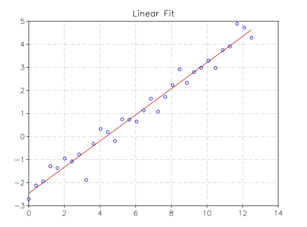

.. highlight:: lua

.. include:: <isogrk1.txt>

Linear Least Squares fit
===========================

Overview
--------

This chapter describes routines for performing least squares fits to experimental data using linear combinations of functions.  The data may be weighted or unweighted, i.e. with known or unknown errors.  For weighted data the functions compute the best fit parameters and their associated covariance matrix.  For unweighted data the covariance matrix is estimated from the scatter of the points, giving a variance-covariance matrix.

Linear Fit Functions
--------------------

.. function:: linfit(X, y[, w])

    Perform a linear fit for the observations ``y`` using the model matrix ``X``. It does return a vector with the coefficients of the fit, the residual chi square and the covariance matrix. You can optionally provides the weights ``w`` of the observations to obtain a weighted linear fit. The argument ``y`` should be a column matrix of length N while the model ``X`` should be a N x M matrix where M is the number of basis in the linear model.

    *Example*
       Let us suppose that we have two column matrix, x and y, and we want to make a linear fit of y versus x. We build first the model matrix and then we use it to make the linear fit::

          X = matrix.new(n, 2, |i,j| j == 1 and 1 or x[i])
          c, chisq, cov = linfit(X, y)

       The function returns the fit coefficients, the residual chi square and the covariance matrix.

Complete Example
----------------

We give a complete example where a set of (x, y) observations are simulated and a linear fit is done::

            x0, x1, n = 0, 12.5, 32
            a, b = 0.55, -2.4
            xsmp = |i| (i-1)/(n-1) * x1

	    r = rng.new()
	    x = matrix.new(n, 1, xsmp)
	    y = matrix.new(n, 1, |i| a*xsmp(i) + b + rnd.gaussian(r, 0.4))

            -- model matrix for the linear fit
            X = matrix.new(n, 2, |i,j| j == 1 and 1 or x[i])

	    print('Linear fit coefficients: ')
            c, chisq, cov = num.linfit(X, y)
            print(c)

            fit = function(x) return c[1]+c[2]*x end

	    p = graph.fxplot(fit, x0, x1)
	    p:addline(graph.xyline(x, y), 'blue', {{'marker', size=5}})
	    p.title = 'Linear Fit'

