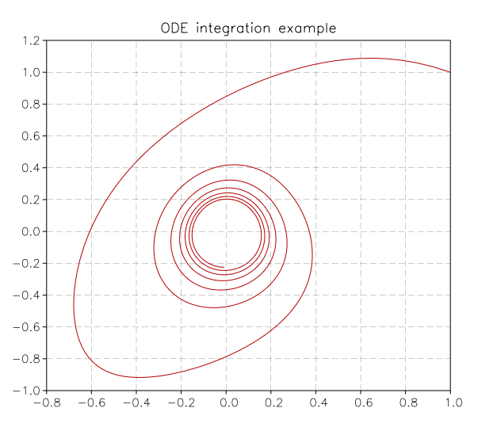

.. highlight:: lua

.. include:: <isogrk1.txt>

.. currentmodule:: num

Ordinary Differential Equations
===============================

Overview
--------

This chapter describes functions for solving ordinary differential equation (ODE) initial value problems. 

.. note::
  The ODE integration routines in GSL Shell are based on GSL routines but they are completely rewritten in Lua.
  Only a few integration methods are actually available for the moment such as Runge-Kutta-Fehlberg and Price-Dormand methods.

  The actual interface is also likely to be changed in the near future to handle ODE systems in array form.

In GSL Shell an ODE system is integrated by using an ODE solver object.
The ODE solver store internally the state of the solver and you can advance the solution step-by-step until, eventually, the desired value of t is reached.

Creating a ODE system solver
----------------------------

An ODE solver allows users to obtain a numerical solution of an Ordinary
Differential Equation (ODE) system. The ODE solver lets you solve the
general n-dimensional first-order system,

.. math::
     \frac{\textrm{d}y_i(t)}{\textrm{d}t} = f_i(t, y_1(t), ..., y_n(t))

for :math:`i = 1, \dots, n`.
The stepping functions rely on the vector of derivatives :math:`f_i` and, for some methods, also on the Jacobian matrix,

.. math::
   J_{ij} = \frac{\partial f_i}{\partial y_j}\left(t,y(t)\right)

For the moment all the methods implemented in GSL Shell does not use the Jacobian matrix.

.. note::
   The current implementation is limited to systems with a few number of variables.
   Probably you should avoid to use it if you have more than 20 variables.
   An implementation for ODE systems in array form should be available in the near future.

ODE solver usage example
------------------------

Here an examples about the usage of an ODE solver. The differential equation that we want integrate is:

   .. math::
      \begin{array}{ll}
         x' = & -y - x^2 \\
	 y' = & 2 x - y^3
      \end{array}

and here the code that we can write to implement it::

   -- define the ODE function
   function odef(t, x, y)
      return -y-x^2, 2*x - y^3
   end

   -- create the ODE solver
   s = num.ode {N= 2, eps_abs= 1e-8}

   -- we define initial values
   t0, t1, h0 = 0, 30, 0.04
   x0, y0 = 1, 1

   -- we initialize the ODE solver
   s:init(t0, h0, odef, x0, y0)

   -- the ODE solver is iterated till the time t1 is reached
   while s.t < t1 do
      s:evolve(odef, t1)
   end

In anternative you may want to make a plot of the curve that you obtain. Here an example, we create a "path" to describe the curve that we want to plot and then we iterate with the ODE solver and we add all the points with the "line_to" method. The we create an empy plot and we add the line that we have just created::

   -- we create a line and add the points obtained by integrating the ODE
   ln = graph.path(x0, y0)
   while s.t < t1 do
      s:evolve(odef, t1)
      ln:line_to(s.y[1], s.y[2])
   end

   -- we create the plot by adding the line
   p = graph.plot('ODE integration example')
   p:addline(ln)
   p:show()

And here the plot that you will obtain:

   Curve obtained by integration of the above ODE system.

ODE Solver Class Definition
---------------------------

.. class:: ODE
   
   Solver of ODE system.

   .. function:: ode(spec)
      
      Create a new solver for an ODE system. The ``spec`` should be a table
      containing the following fields:
      
      N
          The dimension of the ODE system.
      eps_abs
          The maximum absolute error in the y that should be tolerated.
      eps_rel, *optional*
          The maximum relative error in the y that should be tolerated.
      method, *optional*
          The low-level integration method used. Can be choosed between:

          - rkf45, Embedded Runge-Kutta-Fehlberg (4, 5) method. This method is a good general-purpose integrator.

          - rk8pd, Embedded Runge-Kutta Prince-Dormand (8,9) method.

   .. method:: init(t0, h0, f, y0_1, y0_2, ..., y0_N)
      
      Initialize the state of the solver to the time ``t0``.
      The second argument ``h0`` is the initial step size that the integrator will try.
      The function ``f`` is the function that defines the ODE system.
      It will be called like ``f(t, y_1, y_2, ..., y_N)`` where ``t`` is the time and ``y_1, y_2, ...`` are the values of the N indipendent values conventionnaly denoted here by 'y'.
      The function ``f`` should return N values that correspond to values ``f_i(t, y_1, ..., y_N)`` for each component ``f_i`` of the ODE system function.

   .. method:: evolve(f, t1)

      Advance the solution of the system by a step chosen adaptively based on the previous step size.
      The new values (t, y) are stored internally by the solver and can be retrieved as properties with the name ``t`` and ``y`` where the latter is a column matrix of size N.
      The new values of t will be less than or equal to the value given ``t1``.
      If the value ``s.t`` is less then ``t1`` then the function evolve should be called again by the user.
