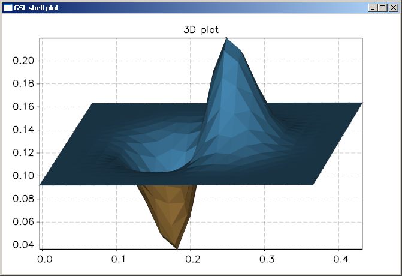
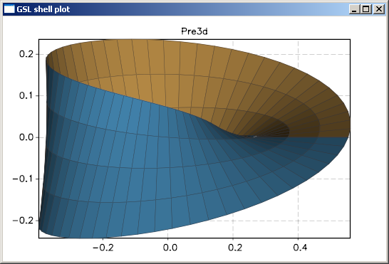

.. highlight:: lua

.. include:: <isogrk1.txt>

.. currentmodule:: graph

3D Plotting
===========

Overview
--------

GSL shell offer, since the release 1.0, the possibility of making three dimensional plots and animations. The module for this kind of plots is based on the `Pre3d <http://deanm.github.com/pre3d/>`_ JavaScript library of Dean Mc Namee.

The 3D plotting functions works by creating a :class:`Plot` object and is therefore fully compatible with all the standard operations used for 2D graphics.

The functions for 3D plotting are defined in the module ``plot3d``.

.. warning:: 

  While this module is fully functional it does have some major
  limitations you should be aware of:

    * the module is not suitable for complex 3D graphics with a lot of polygons
    * the memory usage is quite important and if you perform plots with many meshes you may note an important usage of memory
    * the rendering speed is quite slow for scene with many polygons

  In future we may change the implementation of the 3D plotting module
  in order to have a more efficient implementation.

3D Function Plot
----------------

The 3D Function Plot give you the possibility of making a 3D plot of a function of the form ``z = f(x, y)`` over a rectangular domain. Here the description of the function:

.. function:: plot3d(f, xmin, ymin, xmax, ymax[, options])

   Make a 3D plot of the function ``f(x, y)`` over the rectangular domain defined by ``xmin``, ``ymin``, ``xmax`` and ``ymax``. 

   The ``options`` argument is an optional table that can contain the following field:
 
   * ``gridx``, number of subdivision along x
   * ``gridy``, number of subdivision along y
   * ``title``, the title of the plot
   * ``stroke``, a boolean valua that indicate if the wireframe
     should be drawn or not.

Here a simples example::

   import 'math'
   require 'plot3d'
   f = |x, y| sin(x)*exp(-x^2-y^2)
   graph.plot3d(f, -3, -3, 3, 3, {title= '3d plot'})

and here the plot that you will obtain:

Parametric Surface Plot
-----------------------

The Parametric Surface Plot function allow the plotting of a 3D surface defined in the parametric form:

.. math::
   \begin{array}{ll}
     x = & z(u, v) \\
     y = & y(u, v) \\
     z = & z(u, v)
   \end{array}

where u and v are two parameters that span a rectangular domain.

.. function:: surfplot({x, y, z}, umin, vmin, umax, vmax[, options])

   Make a 3D plot of the parameteric surface defined by the functions ``x(u, v)``, ``y(u, v)`` and ``z(u, v)`` when the parameters ``(u, v)`` span a rectangular domain defined by ``umin``, ``vmin``, ``umax`` and ``vmax``. 

   The ``options`` argument is an optional table that can contain the following field:
 
   * ``gridu``, number of subdivision along x
   * ``gridv``, number of subdivision along y
   * ``title``, the title of the plot
   * ``stroke``, a boolean valua that indicate if the wireframe should
     be drawn or not.

Here a simples example that plot the Moebius surface starting from a parametric: form:

.. math::
   \begin{array}{ll}
     x = & \left(1 + 1/2 \, v \cos(u/2)\right) \cos(u) \\
     y = & \left(1 + 1/2 \, v \cos(u/2)\right) \sin(u) \\
     z = & 1/2 \, v \sin(u/2)
   \end{array}

here the code to produce the plot::

   import 'math'
   require 'plot3d'

   x = |u,v| (1 + 1/2 * v *cos(u/2))*cos(u)
   y = |u,v| (1 + 1/2 * v *cos(u/2))*sin(u)
   z = |u,v| 1/2 * v * sin(u/2)
   
   graph.surfplot({x, y, z}, 0, -1, 2*pi, 1, {gridu= 60, gridv= 4, stroke= true})

and here an image of the resulting plot:

